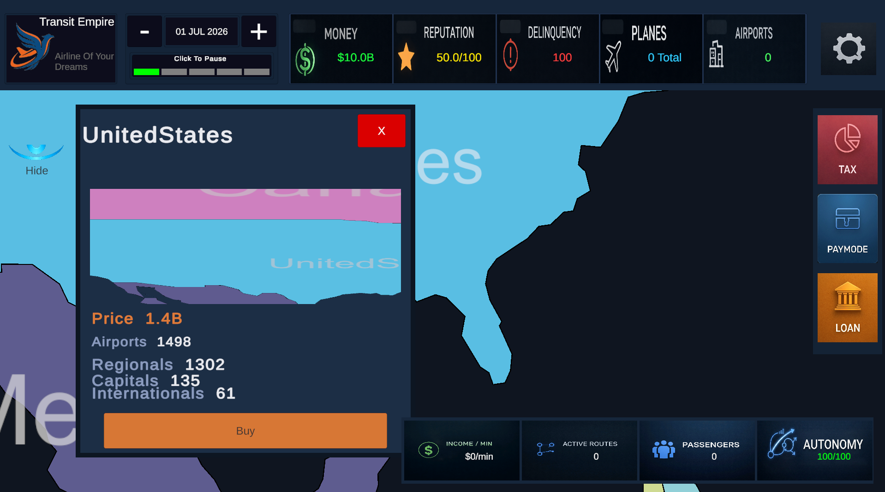
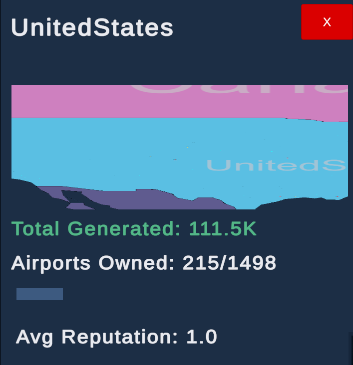
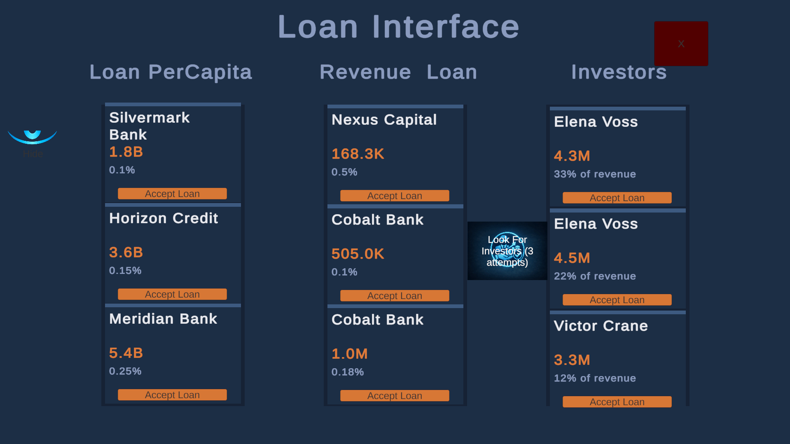

# Transit Empire

**Transit Empire** is a large-scale Unity/C# prototype for a global airline management simulator.

The project focuses on simulation systems, world generation, airline operations, aircraft routing, economy, financing, and persistence. It was built as a technical prototype to explore how a data-driven airline management game could work at global scale.


---

## Overview

Transit Empire is an airline management simulation prototype where the player builds an airline operations network by purchasing countries, unlocking airports, creating routes, assigning aircraft, managing finances, and expanding across a generated world map.

The game includes:

- A global country map generated from external data.
- Thousands of airports distributed by country, continent, and airport type.
- Country purchasing and territorial progression.
- Airport demand, reputation, capacity, upgrades, and maintenance.
- Route creation between airports.
- Aircraft assignment, state simulation, XP, durability, wear, and upgrades.
- Loans, revenue-based financing, and investors.
- Save/load persistence with multiple slots.
- Runtime UI systems for management, settings, garage, routes, and finance.

This repository is not a full source dump. It contains curated documentation, architecture diagrams, and representative code samples that explain the main systems behind the prototype.

---

## Project Context

Transit Empire was my first large Unity/C# project.

It was developed while I was learning Unity architecture, C# patterns, simulation design, UI workflows, persistence, and data-driven world generation. Because of that, some systems reflect prototype-era decisions and could be redesigned with a cleaner architecture today.

I keep this project in my portfolio because it demonstrates large-system thinking: world generation, route simulation, aircraft state machines, economy, financing, save/load persistence, and external data pipelines.

---

## Screenshots

### Main Menu


### Runtime Simulation


### Country Purchase



### Country Progression



### Route Network


### Route Management


### Fleet Assignment


### Financing Offers



---

## Core Gameplay Loop

The simulation is built around a management loop:

```text
Buy country
→ unlock airports
→ buy or manage airports
→ create routes
→ assign aircraft
→ transport passengers
→ generate revenue
→ upgrade airports and aircraft
→ expand to more countries
```

The player does not directly control aircraft movement. Instead, the focus is on strategic decisions: route planning, aircraft allocation, financing, infrastructure growth, and long-term expansion.

---

## Main Systems

### World Generation

Transit Empire uses external data to generate a large world map with countries and airports.

The world generation pipeline includes:

- Country polygon data converted into Unity-ready country visuals.
- Airport CSV data converted into a gameplay dataset.
- Airport tier assignment by country.
- Regional, capital, and international airport classification.
- Synthetic fallback generation for countries with insufficient real airport data.
- Minimum distance filtering to avoid overcrowded airport clusters.

Relevant files:

```text
docs/data-pipeline.md
docs/airport-system.md
code-samples/AirportDataPipeline.sample.py
code-samples/AirportGenerator.sample.cs
code-samples/CountryBorderGenerator.sample.cs
```

---

### Country Progression

Countries act as progression containers. Each country owns a set of airports and unlocks more airports as economic development increases.

Country progression includes:

- Purchase price calculation based on airport count and country cost multiplier.
- Initial airport visibility when the country is activated.
- Dynamic unlocking of regional, capital, and international airports.
- Development generated by aircraft revenue.
- Country-level aggregate metrics such as generated income, owned airports, and average reputation.

Relevant files:

```text
docs/airport-system.md
code-samples/CountryProgression.sample.cs
```

---

### Airport Simulation

Airports are active simulation entities. They generate passengers, store demand by destination, track reputation, enforce capacity limits, and expose upgrade paths.

Airport simulation includes:

- Passenger demand generation.
- Demand distribution by route destination.
- Capacity pressure and overflow handling.
- Reputation penalties when airports become overloaded.
- Airport XP and level-up logic.
- Infrastructure upgrades for runways, route slots, capacity, and reputation.
- Maintenance costs and debt accumulation.

Relevant files:

```text
docs/airport-system.md
code-samples/Airport.sample.cs
```

---

### Route System

Routes connect airports and define the operational network of the airline.

The route system includes:

- Route creation mode.
- Route confirmation flow.
- Route selection.
- Dynamic route buttons.
- Route metrics.
- Historical route statistics.
- Active aircraft contribution to route statistics.
- Transitions into fleet assignment mode.

Relevant files:

```text
docs/route-system.md
code-samples/RouteManager.sample.cs
```

---

### Aircraft Simulation

Aircraft are simulated using a runtime state machine.

Aircraft states include:

```text
Idle
Boarding
Flying
Arrived
Waiting
Turnaround
OutOfService
```

Aircraft simulation includes:

- Boarding logic.
- Passenger loading.
- Route traversal using Bezier movement.
- Trip revenue calculation.
- Fuel cost calculation.
- Passenger redistribution.
- XP gain.
- Durability, HP, wear, and reliability.
- Critical failures and repair handling.
- Aircraft stat upgrades.

Relevant files:

```text
docs/simulation-system.md
code-samples/PlaneStateMachine.sample.cs
code-samples/InformationManager.sample.cs
```

---

### Economy and Financing

Transit Empire includes multiple financing systems to support expansion.

The financing system includes:

- Standard loans based on current cash.
- Revenue-based loans based on aircraft route performance.
- Investors that provide cash in exchange for company autonomy.
- Active debt management.
- Daily payment toggles.
- Early repayment discounts.
- Penalty logic for unpaid loans.

Relevant files:

```text
docs/economy-system.md
code-samples/LoanManager.sample.cs
```

---

### Save and Load System

The prototype includes JSON-based persistence with multiple save slots.

The save system stores:

- Global money and date.
- Airline metrics.
- Country state.
- Airport ownership and progression.
- Passenger demand dictionaries.
- Route statistics.
- Aircraft state.
- Garage and route assignments.
- Loan and investor state.

The load process uses a multi-pass restore strategy to rebuild object references after the generated world exists again.

Relevant files:

```text
docs/save-system.md
code-samples/SaveManager.sample.cs
```

---

## Technical Highlights

### Data-driven world generation

The game does not manually place every airport. A Python pipeline processes airport and country data into JSON files consumed by Unity.

### Runtime country mesh generation

Country visuals are generated from polygon and triangulation data using Unity components such as:

```text
LineRenderer
MeshFilter
MeshRenderer
PolygonCollider2D
TextMesh
```

### Aircraft state machine

Aircraft behavior is separated into operational states such as boarding, flying, arrival, turnaround, and repair.

### Persistent simulation state

The project saves complex runtime state, including generated-world references, airport dictionaries, aircraft assignments, route statistics, and financing data.

### Management UI integration

The UI connects several gameplay systems: aircraft inspection, route management, financing, country purchase, airport upgrades, save/load, and settings.

---

## Repository Structure

```text
transit-empire.docs/
├── screenshots/
│   ├── main-menu.png
│   ├── world-map.png
│   ├── runtime-simulation.png
│   ├── country-purchase..png
│   ├── country-progress.png
│   ├── route-network-closeup.png
│   ├── route-details-panel.png
│   ├── fleet-assignment.png
│   └── financing-offers.png
│
├── code-samples/
│   ├── GameManager.sample.cs
│   ├── SaveManager.sample.cs
│   ├── PlaneStateMachine.sample.cs
│   ├── Airport.sample.cs
│   ├── AirportGenerator.sample.cs
│   ├── CountryProgression.sample.cs
│   ├── CountryBorderGenerator.sample.cs
│   ├── RouteManager.sample.cs
│   ├── LoanManager.sample.cs
│   ├── InformationManager.sample.cs
│   └── AirportDataPipeline.sample.py
│
├── diagrams/
│   ├── architecture.mmd
│   ├── simulation-loop.mmd
│   ├── save-flow.mmd
│   ├── route-system.mmd
│   ├── economy.mmd
│   ├── world-generation.mmd
│   ├── aircraft-state-machine.mmd
│   ├── ui-flow.mmd
│   └── data-pipeline.mmd
│
└── docs/
    ├── architecture.md
    ├── simulation-system.md
    ├── economy-system.md
    ├── route-system.md
    ├── save-system.md
    ├── airport-system.md
    ├── data-pipeline.md
    ├── services-system.md
    ├── ui-system.md
    ├── input-and-onboarding.md
    ├── module-responsibilities.md
    ├── system-flow.md
    ├── technical-notes.md
    ├── refactor-roadmap.md
    ├── glossary.md
    ├── portfolio-positioning.md
    └── engineering-summary.md
```

---

## Code Samples

The files in `code-samples/` are representative samples, not production-ready drop-in scripts.

They were cleaned and reduced to communicate the architecture and main logic clearly without exposing the entire project source.

Key samples:

| Sample                             | Purpose                                              |
| ----------------------------------- | ----------------------------------------------------- |
| `GameManager.sample.cs`            | Central simulation orchestration                     |
| `SaveManager.sample.cs`            | JSON persistence and multi-pass restore              |
| `PlaneStateMachine.sample.cs`      | Aircraft runtime behavior                            |
| `Airport.sample.cs`                | Airport demand, capacity, reputation, and upgrades   |
| `AirportGenerator.sample.cs`       | Airport world generation from JSON                   |
| `CountryProgression.sample.cs`     | Country unlock and development system                |
| `CountryBorderGenerator.sample.cs` | Country mesh, border, collider, and label generation |
| `RouteManager.sample.cs`           | Route UI and route metric aggregation                |
| `LoanManager.sample.cs`            | Loans, investors, and debt management                |
| `InformationManager.sample.cs`     | Aircraft inspection and contextual UI                |
| `AirportDataPipeline.sample.py`    | Python pipeline for generating airport data          |

---

## Architecture Diagrams

The `diagrams/` directory contains Mermaid diagrams for the main systems:

```text
architecture.mmd
simulation-loop.mmd
aircraft-state-machine.mmd
world-generation.mmd
data-pipeline.mmd
route-system.mmd
economy.mmd
save-flow.mmd
ui-flow.mmd
```

These diagrams document the relationships between managers, simulation entities, UI controllers, data pipelines, and persistence systems.

---

## Documentation

The `docs/` directory contains deeper technical documentation for each major system.

Recommended reading order:

```text
docs/engineering-summary.md
docs/architecture.md
docs/system-flow.md
docs/simulation-system.md
docs/airport-system.md
docs/route-system.md
docs/economy-system.md
docs/save-system.md
docs/data-pipeline.md
docs/refactor-roadmap.md
```

---

## Known Limitations

Transit Empire is a prototype, not a finished commercial release.

Known limitations include:

- UI layout is functional but not fully polished.
- Some systems are tightly coupled to the central `GameManager`.
- Some UI controllers mix presentation logic with gameplay actions.
- Several systems would benefit from stronger separation between domain logic, services, and views.
- The project grew organically while I was learning Unity and C#.

Today, I would redesign parts of the architecture using cleaner boundaries, explicit domain services, event-driven communication, better UI state management, and stronger data validation.

---

## What I Would Improve Today

If I rebuilt this project now, I would focus on:

- Splitting `GameManager` into smaller domain services.
- Moving business logic out of UI controllers.
- Replacing direct singleton access with dependency boundaries.
- Adding stronger save schema versioning.
- Improving UI scaling and layout consistency.
- Adding automated simulation tests.
- Creating a clearer event system for route, finance, airport, and aircraft updates.
- Separating data import tools from runtime generation code.

---

## What This Project Demonstrates

Transit Empire demonstrates my ability to build and connect large gameplay systems, including:

- Unity runtime simulation.
- C# state machines.
- Data-driven world generation.
- Python data preprocessing.
- Persistent save/load systems.
- Route and aircraft management.
- Economy and financing systems.
- UI-driven management tools.
- Large prototype architecture.
- Technical documentation and portfolio presentation.

---

## Status

This project is currently an archived technical prototype.

It is not being presented as a finished game. It is included as a portfolio project because it shows my growth as a developer and my ability to design and implement interconnected simulation systems.

---

## Tech Stack

```text
Engine: Unity
Language: C#
Data Pipeline: Python
Data Format: JSON
UI: Unity UI, TextMeshPro
Rendering: 2D sprites, LineRenderer, MeshRenderer
Persistence: JSON save files
Documentation: Markdown, Mermaid
```

---

## Author

Developed by **Pval-Dev**.

This repository documents the technical design and implementation approach behind Transit Empire.
