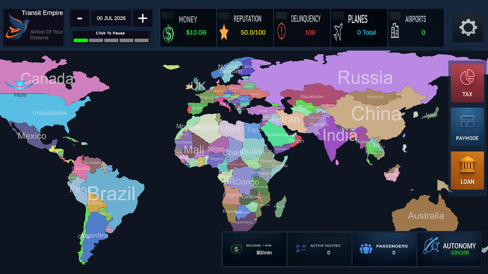
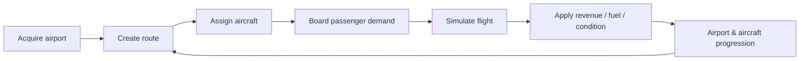
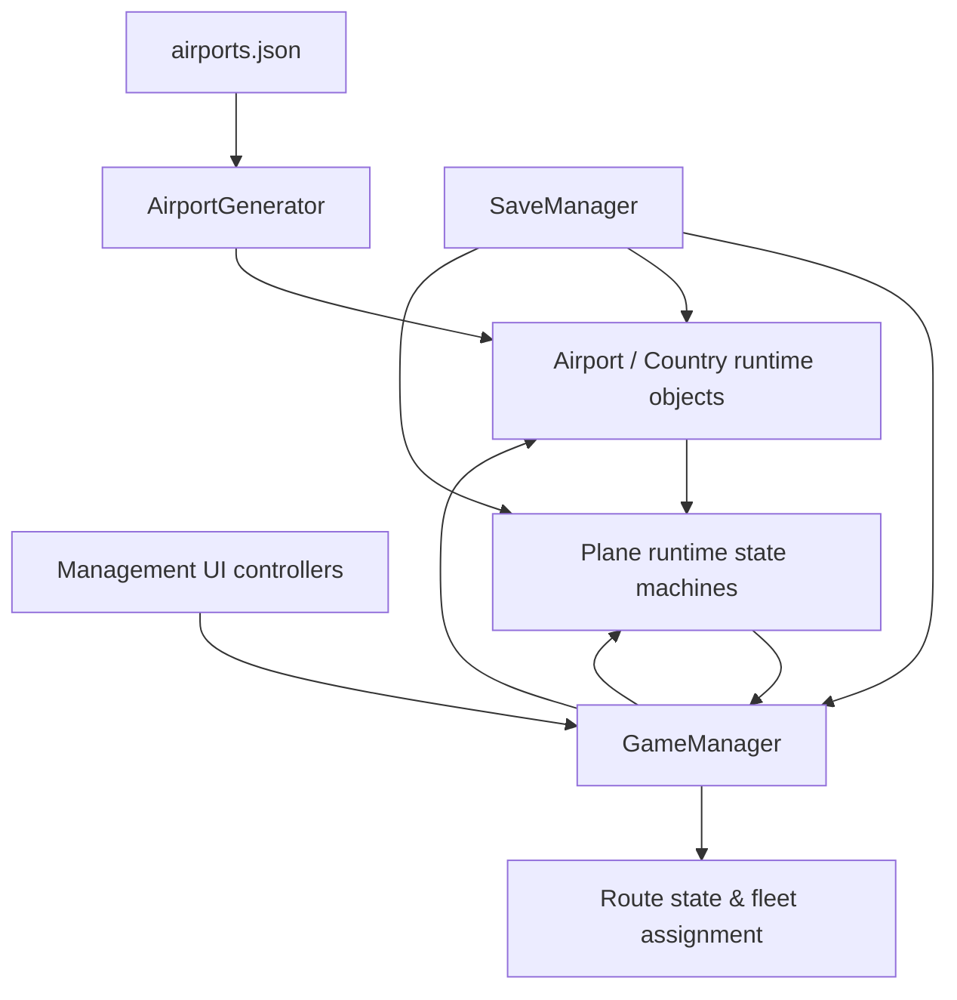
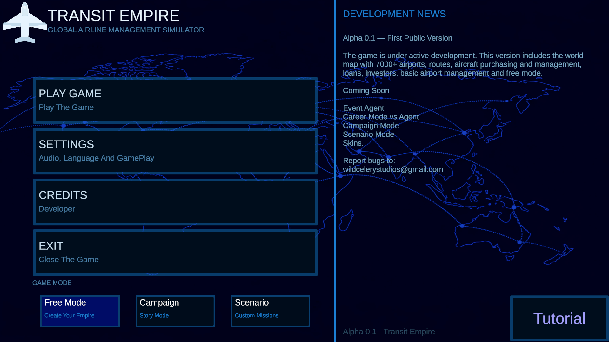
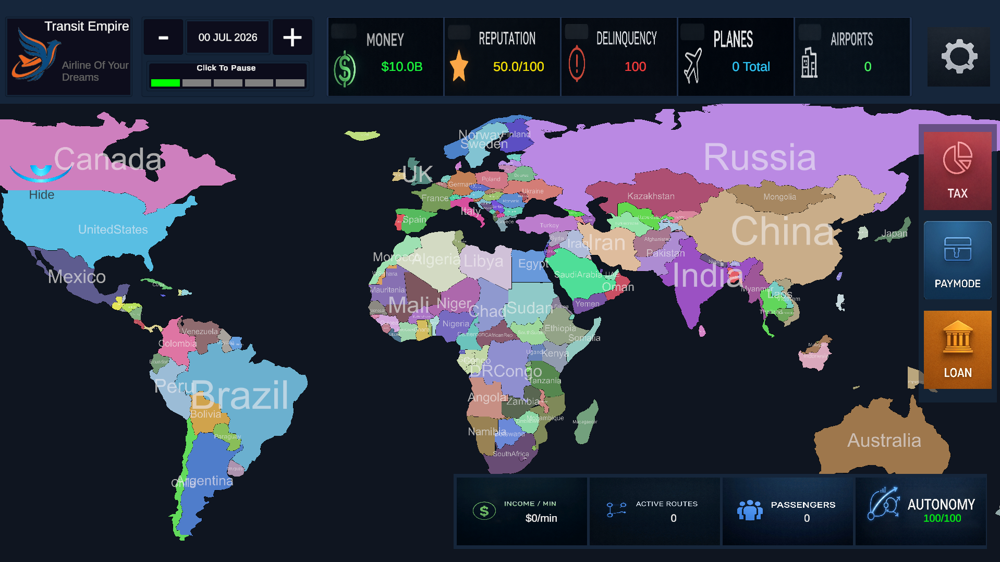
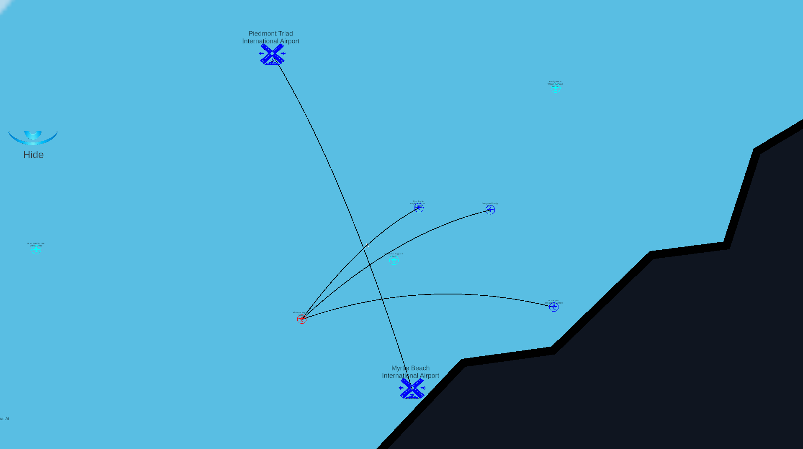
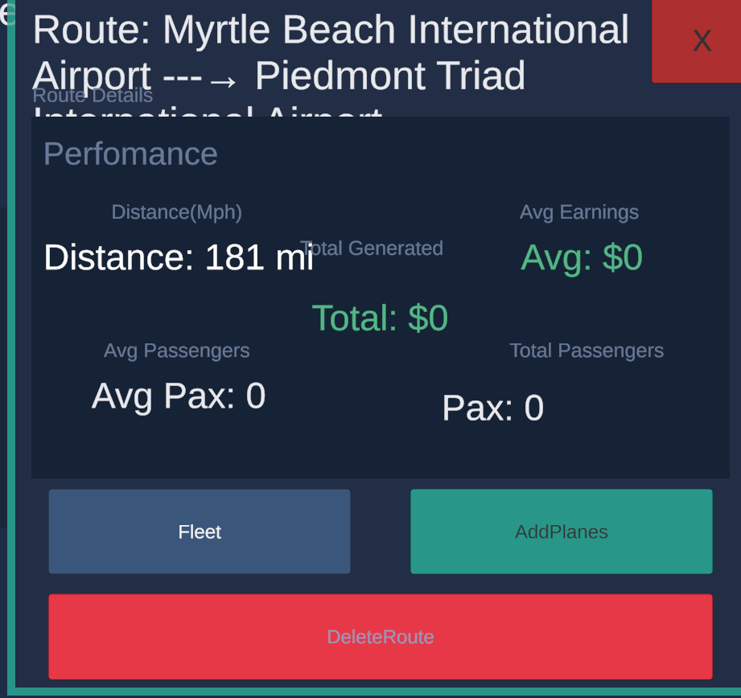
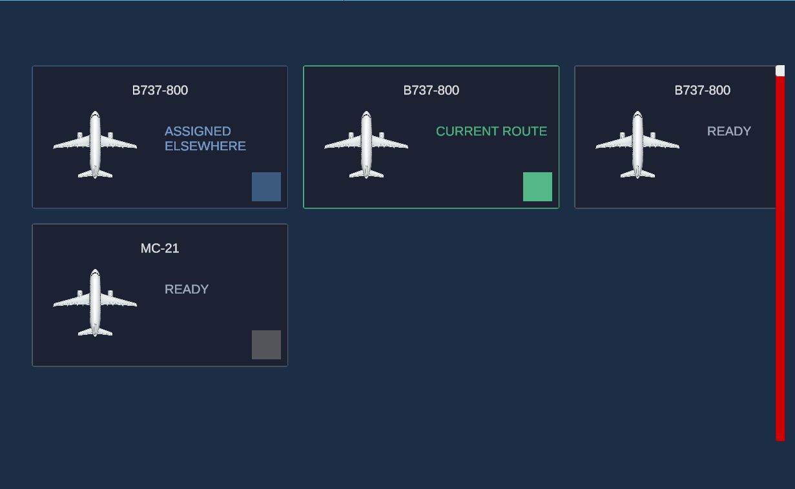

# Transit Empire

> Unity/C# airline-management simulation prototype focused on runtime systems, route/fleet orchestration, passenger demand, aircraft lifecycle state, and persistence.

**Transit Empire** is an archived management-simulation prototype built in Unity. The player grows an airline by purchasing airports, creating routes, assigning aircraft, transporting direct and connecting passengers, and reinvesting revenue into airport and fleet progression.

This repository is a **curated technical portfolio**, not a full Unity project export. The code samples are reconstructed from archived source, while historical project-scale details are called out explicitly when the reduced Unity snapshot no longer contains the full generated data used during development.



---

## Engineering Highlights

- **Real-world airport data pipeline** built in Python from an external airport CSV containing geographic latitude/longitude and airport metadata, then transformed into Unity-ready gameplay JSON.
- **Data-driven airport generation** from that JSON resource into a continent/country hierarchy.
- **Destination-level passenger demand** stored per airport with different generation rules for regional, capital, and international airports.
- **Route and fleet constraints** including route-slot capacity, runway capacity, route pricing, and aircraft reassignment.
- **Aircraft lifecycle state machine** covering `Idle`, `Boarding`, `Flying`, `Arrived`, `Waiting`, `Turnaround`, and `OutOfService`.
- **Connection-passenger handling** with a manifest that transfers passengers through intermediate airports.
- **Aircraft wear and reliability simulation** with mileage-based degradation, critical-failure probability, repair time, and repair cost.
- **Progression systems** for both airports and aircraft using XP, levels, stat points, and upgrade curves.
- **JSON persistence** for global economy state, purchased airports, routes, and aircraft assignments/stats using a staged reconstruction pass.
- **Management UI orchestration** for airport purchase, route creation, fleet assignment, aircraft inspection, and speed controls.

---

## Core Simulation Loop



The project is systems-driven rather than direct-control focused: aircraft execute their own runtime lifecycle while the player manages network and capacity decisions.

---

## Architecture



The original prototype uses `GameManager` as a central coordinator. That made iteration fast, but it also became the largest coupling point in the project. The architectural notes document both the useful boundaries and the places I would split today.

See [`docs/architecture.md`](docs/architecture.md).

---

## Aircraft Runtime

Aircraft progress through explicit operational states:

```text
Idle
  ↓
Boarding ── insufficient demand ──> Waiting
  ↓                                 │
Flying <────────────────────────────┘
  ↓
Arrived
  ↓
Turnaround
  ↓
Boarding

Flying ── critical condition failure ──> OutOfService ──> Boarding / Idle
```

During boarding, direct passengers are loaded first. Remaining capacity can be filled by passengers whose final destination can be reached through the current network. A connection manifest preserves those final destinations until arrival.

During flight, distance contributes to wear and reliability changes. Low reliability can trigger a critical failure, forcing the aircraft into the repair path.

Representative code: [`AircraftStateMachine.sample.cs`](code-samples/AircraftStateMachine.sample.cs)

---

## Airport Demand and Progression

Each airport maintains a destination-demand dictionary:

```csharp
Dictionary<Airport, int> passengersByRoute;
```

Passenger generation is influenced by continent, country, airport, reputation, and airport-type multipliers. Destination selection changes by airport category:

- **Regional** airports favor nearby airports in the same country.
- **Capital** airports favor nearby airports in the same continent.
- **International** airports sample from higher-tier airports across the active network.

Capacity pressure can reduce reputation, while flights award airport XP. Airport progression can increase runway capacity, route slots, passenger capacity, and reputation ceiling.

Representative code: [`AirportDemand.sample.cs`](code-samples/AirportDemand.sample.cs)

---

## Route and Fleet Operations

Route creation is not just a visual line. The runtime checks and updates several pieces of state:

```text
origin / destination validation
→ route price
→ route-slot availability
→ outbound + inbound route references
→ passenger-demand entry
→ route ownership cost
→ aircraft runway-capacity check
→ aircraft destination assignment
```

Historical route metrics are accumulated when aircraft are removed from a route.

Representative code: [`RouteOperations.sample.cs`](code-samples/RouteOperations.sample.cs)

---

## Persistence

The prototype saves to one JSON file under `Application.persistentDataPath`.

The save contains:

- global money, elapsed days, earned/spent totals;
- purchased airport state and upgrade values;
- route references stored as indexes into the generated airport list;
- aircraft stats, progression, condition, origin/destination references, and runtime state.

Loading is staged: first airports are restored, then route references, then aircraft are recreated and reattached to their origin/destination airports.

This is a useful reconstruction strategy for Unity object references, but it is still prototype persistence: there is no schema versioning or migration layer.

Representative code: [`SaveManager.sample.cs`](code-samples/SaveManager.sample.cs)

---

## Real-World Airport Data Pipeline

Transit Empire did not rely on hand-authored airport positions. A Python preprocessing pipeline consumed a real-world airport CSV containing airport type, ISO country, IATA code, scheduled-service information, and geographic latitude/longitude.

The pipeline:

```text
real-world airport CSV
→ validate airport type and coordinates
→ group by ISO country
→ rank airports by type / service / IATA availability
→ allocate international, capital/hub, and regional gameplay tiers
→ preserve longitude/latitude as Unity map coordinates
→ filter airports that are too close together
→ export airports.json for Unity
```

Historical project iterations used **roughly 20,000 real airport locations**. The archived generator script preserved with the project is a later balancing variant configured around a **10,000-airport target**, so the small generated JSON found in the reduced Unity snapshot is not representative of the full data pipeline used during development.

The pipeline also consumed country GeoJSON so countries could be mapped consistently and, where necessary, fallback airport positions could be generated inside country polygons.

Representative code:

- [`AirportDataPipeline.sample.py`](code-samples/AirportDataPipeline.sample.py)
- [`AirportGenerator.sample.cs`](code-samples/AirportGenerator.sample.cs)

---

## Screenshots

### Main Menu


### Runtime Simulation


### Country / Airport Acquisition


### Route Network


### Route Details


### Fleet Assignment


---

## Selected Code Samples

| Sample | Demonstrates |
|---|---|
| [`AircraftStateMachine.sample.cs`](code-samples/AircraftStateMachine.sample.cs) | State transitions, boarding, connection demand, movement, wear, critical failure, turnaround |
| [`AirportDemand.sample.cs`](code-samples/AirportDemand.sample.cs) | Destination demand, capacity pressure, reputation, airport XP/upgrades |
| [`RouteOperations.sample.cs`](code-samples/RouteOperations.sample.cs) | Route pricing, slot/runway validation, route creation, fleet assignment |
| [`SaveManager.sample.cs`](code-samples/SaveManager.sample.cs) | JSON serialization and staged reference reconstruction |
| [`AirportDataPipeline.sample.py`](code-samples/AirportDataPipeline.sample.py) | Real-world airport CSV ingestion, coordinate preservation, ranking, tier allocation, JSON export |
| [`AirportGenerator.sample.cs`](code-samples/AirportGenerator.sample.cs) | JSON-driven runtime object generation and hierarchy setup |

These are **curated excerpts** from the archived source and preprocessing tools. Some field names and method boundaries were normalized for readability, but no additional gameplay systems were invented for the portfolio version.

---

## Documentation

- [`docs/architecture.md`](docs/architecture.md) — runtime boundaries and system relationships.
- [`docs/persistence.md`](docs/persistence.md) — save model, reconstruction flow, and limitations.
- [`docs/engineering-notes.md`](docs/engineering-notes.md) — what worked, what aged poorly, and how I would redesign it today.
- [`docs/README.md`](docs/README.md) — documentation index.

Editable Mermaid sources live under [`diagrams/`](diagrams/).

---

## What I Would Change Today

Transit Empire was one of my earlier large Unity/C# systems projects. The prototype works through direct Unity object references and a central manager, but today I would redesign several boundaries:

- split the ~900-line `GameManager` into route, fleet, economy, selection, and simulation services;
- move business rules out of UI controllers;
- replace broad singleton access with explicit dependencies/events;
- separate persistent IDs from scene/runtime object references;
- version the save schema and add migration logic;
- add deterministic simulation tests for demand, route economics, and state transitions;
- replace polling/`InvokeRepeating` coordination with clearer simulation ticks where appropriate;
- isolate catalog/balance data from runtime orchestration.

Those limitations are part of why the project is useful in the portfolio: it shows both the scale of the system I could build and the architectural problems I learned to recognize afterward.

---

## Verified Scope / Removed Experiments

The original project folder also contained an unfinished **Unity ML-Agents experiment**. The agent scripts were not referenced by the archived scene or prefabs, and ML-Agents was not part of the implemented game loop. It is intentionally excluded from this portfolio repository.

The portfolio distinguishes between code directly recoverable from the archived Unity snapshot and historical project-scale details that are supported by the preserved preprocessing tools and project records.

---

## Project Status

**Archived prototype / portfolio project.**

Transit Empire is not presented as a finished commercial game. Its value is the interconnected simulation work: demand generation, routes, fleet state, economy, progression, runtime recovery, UI orchestration, persistence, and real-world data preprocessing.

---

## Tech Stack

```text
Engine: Unity 6 (6000.4.0f1)
Language: C#
Data Pipeline: Python
Rendering: Universal Render Pipeline / 2D
UI: Unity UI + TextMeshPro
Input: Unity Input System
Persistence: JsonUtility + local JSON file
Data: real-world airport CSV + GeoJSON → Unity JSON Resources
Documentation: Markdown + Mermaid
```

## Author

Developed by **Pval-Dev**.