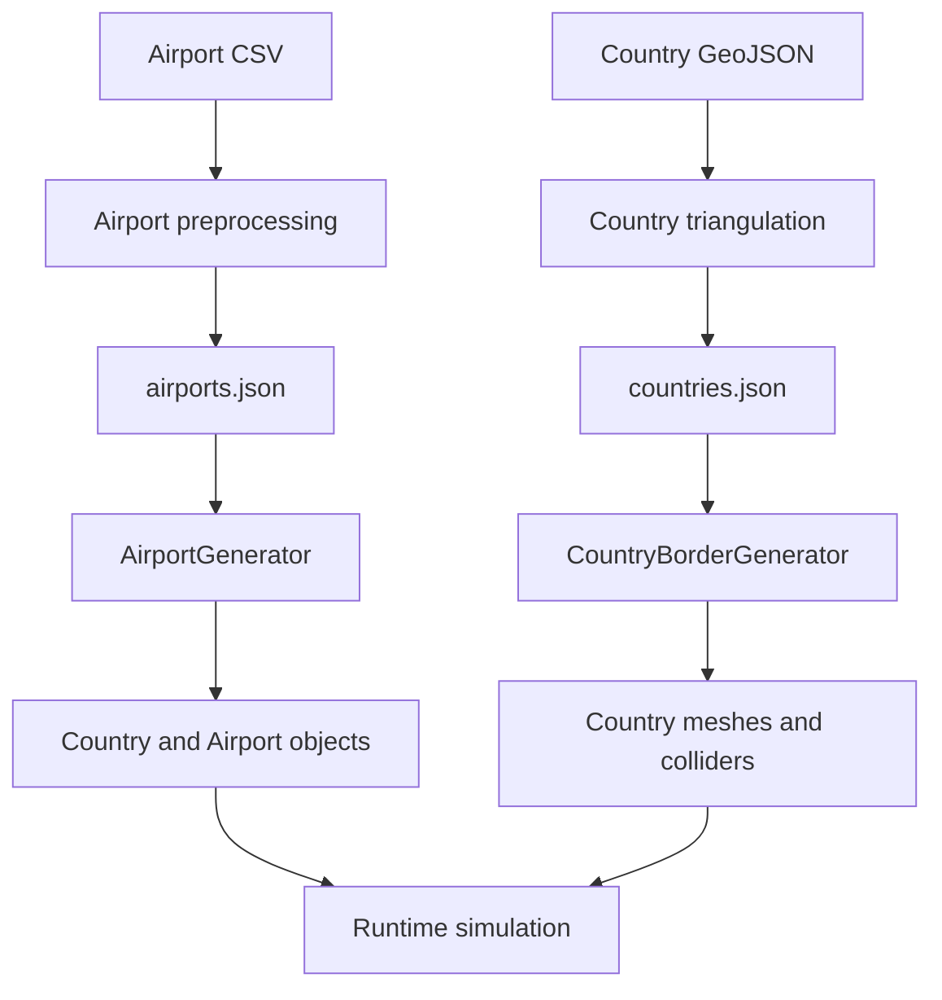

# Airport And World System

Transit Empire uses a data-driven world system to generate countries, airports, borders, colliders, labels, and airport purchase points at runtime.

This system connects external datasets, Python preprocessing scripts, Unity runtime builders, and simulation entities.

## World System Overview



## Main Components

| Component | Responsibility |
|---|---|
| `generate_airports.py` | Converts real airport data into a Unity-ready airport dataset |
| Country triangulation script | Converts GeoJSON country polygons into points and triangles |
| `airports.json` | Runtime airport dataset |
| `countries.json` | Runtime country geometry dataset |
| `AirportGenerator` | Instantiates countries, airports, sprites, colliders, and purchase buttons |
| `CountryBorderGenerator` | Builds country meshes, borders, labels, colliders, and click handlers |
| `Country` | Stores country state, price, airport lists, and development progression |
| `Airport` | Stores airport state, demand, routes, capacity, reputation, and maintenance |
| `CountryClickHandler` | Handles country selection on the map |
| `AirportActivator` | Handles unowned airport purchase interaction |
| `AirPortBuyPlanes` | Handles owned airport interaction and route destination selection |

## Data Preprocessing

Transit Empire does not rely only on manually placed map objects.

The project includes preprocessing scripts that transform external data into runtime datasets.

### Airport Dataset

The airport preprocessing script reads airport CSV data and maps airports into simulation types:

| Type | Meaning |
|---|---|
| `0` | Regional |
| `1` | Capital / hub |
| `2` | International |

The generated airport records include:

- Airport name
- X/Y map coordinates
- Continent
- Country
- Country price multiplier
- Passenger multiplier
- Airport type
- Secondary demand multipliers

The output is saved as:

```text
airports.json
```

### Country Dataset

The country preprocessing script reads GeoJSON country geometry and outputs:

- Country name
- Continent
- Color
- Border points
- Triangulated mesh data

The output is saved as:

```text
countries.json
```

This allows Unity to build country visuals and colliders dynamically.

## AirportGenerator

`AirportGenerator` is responsible for creating the airport world.

It reads:

```csharp
Resources.Load<TextAsset>("airports")
```

Then it creates or configures:

- Country containers
- Country script values
- Airport prefabs
- Airport sprites
- Airport colliders
- Airport simulation data
- Airport purchase buttons
- Airport activators

## Airport Runtime Setup

For each airport entry, `AirportGenerator` configures the `Airport` component with:

- `BaseApPrice`
- `price`
- `AirportName`
- `airportType`
- `Container`
- `CountryHome`
- `secondarymultiplierBASE`
- `MoneyForMaintenance`
- Initial passenger generation behavior

The airport is then added to:

```csharp
GameManager.Instance.AllAirports
```

## CountryBorderGenerator

`CountryBorderGenerator` reads:

```csharp
Resources.Load<TextAsset>("countries")
```

For each country, it builds:

- A border using `LineRenderer`
- A filled mesh using `MeshFilter` and `MeshRenderer`
- A `PolygonCollider2D`
- A country label using `TextMesh`
- A `CountryClickHandler`

This creates both the visual country map and the interactive country selection layer.

## Country System

`Country` represents a territory in the simulation.

It stores:

- Country price
- Passenger multiplier
- Cost multiplier
- Active state
- Total generated value
- Owned airport count
- Average reputation
- Airport lists by type
- Development progress
- Airport unlock thresholds

## Country Activation

When a country is purchased, `Country.ActivateCountry()` reveals a percentage of its airports.

It reveals airports separately by type:

- Regional airports
- Capital airports
- International airports

This creates an initial expansion base instead of unlocking every airport at once.

## Country Development

`Country.AddDevelopment(float money)` increases development progress when airline operations generate money.

Development is tracked separately for each airport type:

```text
RegionalUpdating
CapitalUpdating
InterNationalUpdating
```

When a threshold is reached:

```text
GenerateRandomAirport()
```

is called, making another airport visible for purchase.

## Airport System

`Airport` is the main network node of the simulation.

It stores:

- Airport identity
- Visibility and ownership state
- Passenger capacity
- Current passengers
- Passenger demand per destination
- Routes
- Inbound routes
- Route statistics
- Reputation
- XP and level
- Infrastructure upgrade points
- Runway capacity
- Route slot capacity
- Maintenance cost and debt
- Airport type
- Country and continent references

## Airport Demand Generation

Passenger generation is handled inside `Airport`.

The generated amount depends on:

- Continent multiplier
- Country multiplier
- Airport multiplier
- Airport type
- Reputation
- Secondary multiplier

Passenger demand is distributed into:

```csharp
Dictionary<Airport, int> passengersByRoute
```

This allows the simulation to track where passengers want to go.

## Airport Type Behavior

Airport type changes destination selection behavior.

| Airport Type | Destination Behavior |
|---|---|
| Regional | Prioritizes airports in the same country |
| Capital | Prioritizes airports in the same continent |
| International | Selects broader international targets |

This gives different airport types different strategic roles in the route network.

## Airport Capacity

Airports have a maximum passenger capacity.

If generated passenger demand exceeds capacity, the airport reduces stored demand until the total fits within the limit.

High occupancy affects airport reputation and visual state.

## Airport Reputation

Airport reputation increases over time during passenger generation, but can be penalized when the airport becomes too full.

Reputation affects:

- Passenger generation
- Revenue quality
- Airport performance
- Global reputation indirectly

## Airport Progression

Airports gain XP from aircraft operations.

When enough XP is accumulated, the airport can level up.

Leveling provides stat points, which can be spent on:

- Runway capacity
- Route slot capacity
- Passenger capacity
- Maximum reputation

## Maintenance

Airports accumulate maintenance costs on a monthly cycle.

Maintenance state includes:

- `MoneyForMaintenance`
- `MoneyForMaintenanceUi`
- `Porcent`
- `ticksStart`
- `Protection`
- `consecutivePayments`

Unpaid maintenance contributes to operational pressure and reputation risk.

## Interaction Flow

```text
CountryClickHandler
→ CountryUIManager
→ GameManager.BuyCountry()
→ Country.ActivateCountry()
→ visible airports appear
→ AirportActivator
→ BuyAirportButtomshop
→ GameManager.BuyAirPortFunction()
→ Airport becomes active
```

Owned airports then become interactive through:

```text
AirPortBuyPlanes
```

which opens the airport interface or selects a route destination depending on the current mode.

## Technical Value

The airport and world system demonstrates:

- Data-driven runtime world generation
- External dataset preprocessing
- Dynamic mesh and collider generation
- Runtime object graph creation
- Country-level progression
- Airport-level demand simulation
- Destination-specific passenger maps
- Infrastructure progression
- Maintenance and capacity pressure
- Map-based interaction flow

This system is one of Transit Empire’s strongest engineering areas because it connects real-world style data processing with runtime simulation behavior.
