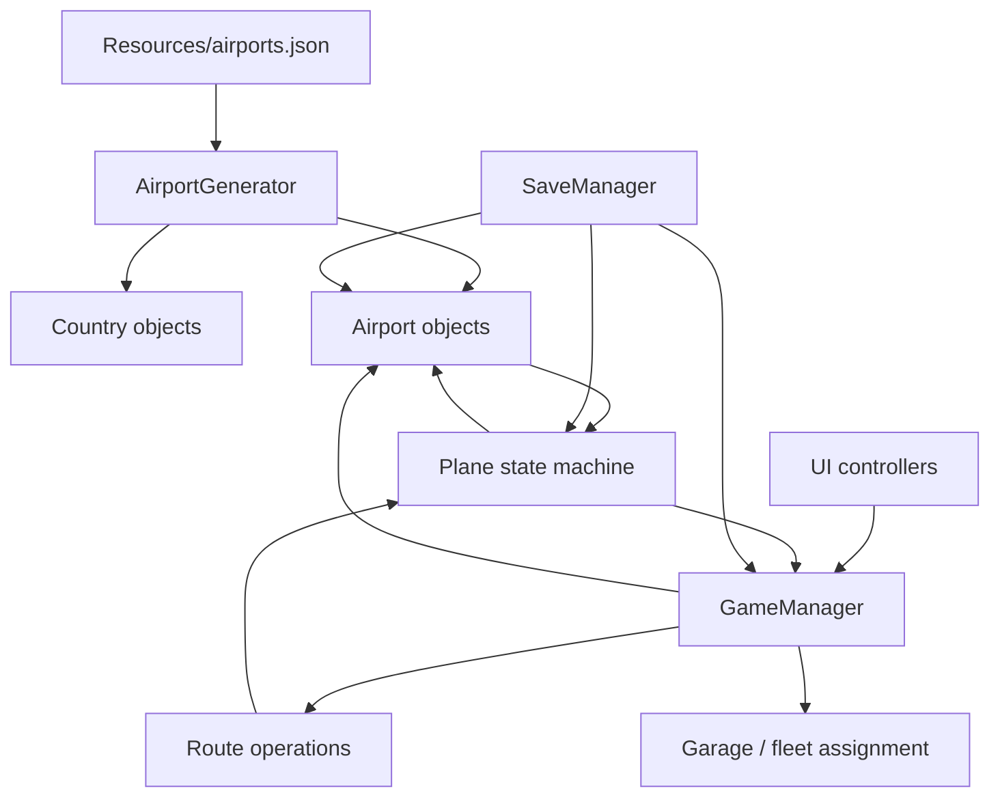

# Architecture

Transit Empire is a Unity management-simulation prototype built around four practical runtime areas: world setup, airport demand, route/fleet operations, and aircraft simulation. Persistence reconstructs enough of that runtime state to resume the network after a restart.

## High-Level View



## 1. World Setup

`AirportGenerator` loads a JSON array from Unity `Resources` and turns each entry into runtime objects.

Each record contains the information required by the current prototype:

```text
airport name
world x/y position
continent code
country
country price multiplier
passenger multiplier
airport type
```

The generator looks up an existing continent object, creates a country prefab if the country does not yet exist, creates the airport prefab, configures its `Airport` component, and registers it in `GameManager.AllAirports`.

The archived JSON is a small dataset, so this repository does not claim that the current snapshot was performance-tested at global scale.

## 2. Airport Simulation

`Airport` owns destination-level demand through:

```csharp
Dictionary<Airport, int> passengersByRoute;
```

When a generation tick executes, the airport calculates a passenger amount from multiple factors:

```text
base demand
× continent multiplier
× country multiplier
× airport multiplier
× secondary/type multiplier
× reputation effect
```

Destination selection depends on airport type:

- regional: nearby purchased airports in the same country;
- capital: nearby purchased airports in the same continent;
- international: a random subset of purchased capital/international airports.

Passenger totals are capped at airport capacity. High occupancy can reduce reputation. Game speed changes reschedule the generation interval through `InvokeRepeating`.

Airports also carry progression state: XP, level, stat points, runway capacity, route slots, capacity, and reputation ceiling.

## 3. Route and Fleet Operations

Route ownership is stored directly on the origin airport as a list of destination `Airport` references. Destination airports also maintain `inboundRoutes`.

`GameManager` coordinates route operations:

```text
select origin
select destination
calculate route price from distance + airport levels
validate route-slot capacity
create outbound/inbound references
seed passenger-demand entry
charge the route cost
```

Aircraft assignment then validates runway capacity before changing the plane destination.

The design is easy to follow in a prototype, but route rules, fleet rules, money mutation, selection state, and UI mode flags all live close together inside `GameManager`. That centralization is the largest architectural debt in the project.

## 4. Aircraft Simulation

`Plane` contains an explicit lifecycle enum:

```text
Idle
Boarding
Flying
Arrived
Waiting
Turnaround
OutOfService
```

`Update` delegates behavior according to the current state.

### Boarding

The plane validates range and checks destination demand. Direct passengers are loaded first. If seats remain, the plane can board connecting passengers when the surrounding route graph offers a useful onward connection. Their final destinations are stored in a connection manifest.

If total available demand is below a configurable fraction of capacity, the plane enters `Waiting` and retries later.

### Flying

The aircraft moves toward its current destination using `Vector2.MoveTowards`. Simulated distance contributes to wear and reliability degradation. A low-reliability aircraft can suffer a critical failure and transition to `OutOfService`.

### Arrival

Arrival updates passenger demand, computes trip economics from passenger count, aircraft type, distance, fuel consumption, reputation, condition, and route-specific bonuses, then awards aircraft and airport XP. The plane reverses direction and enters turnaround.

## 5. Persistence

`SaveManager` is a separate Unity component but still reads/writes state from the central manager and runtime objects.

The save format stores primitive values and list indexes instead of trying to serialize Unity object references directly. Loading is therefore staged:

1. rebuild the purchased-airport list;
2. restore airport state;
3. restore route references from indexes;
4. instantiate aircraft;
5. restore aircraft stats and destinations.

See [Persistence](persistence.md) for details.

## Architectural Strengths

For an early large Unity prototype, several choices were effective:

- explicit aircraft states instead of one monolithic flight loop;
- a destination-level demand model rather than one passenger counter;
- separate airport, aircraft, route, garage, and save concepts;
- runtime generation from data rather than hand-authoring each airport object;
- index-based save reconstruction for Unity references;
- capacity constraints at both airport-route and runway/aircraft levels.

## Architectural Debt

The main limitations are equally visible:

- `GameManager` grew into a broad service locator / coordinator;
- UI scripts call gameplay logic directly and carry mode state;
- many components reach `GameManager.Instance` directly;
- persistent identity is based on list position/name rather than stable IDs;
- simulation timing is spread across `Update`, `InvokeRepeating`, and local timers;
- domain calculations are difficult to test without Unity objects;
- several classes assume a specific scene hierarchy.

A modern rewrite would keep the same domain concepts but move them behind smaller services and testable plain-C# models.
