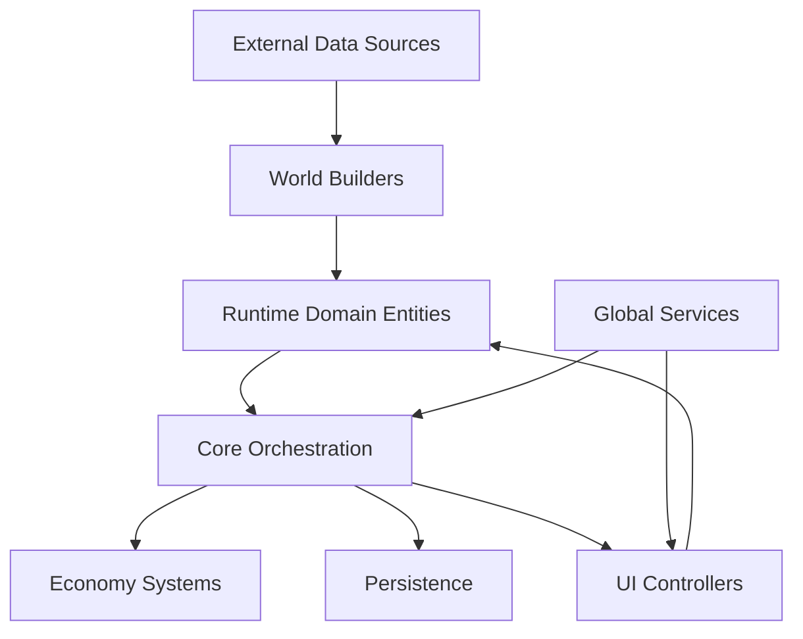
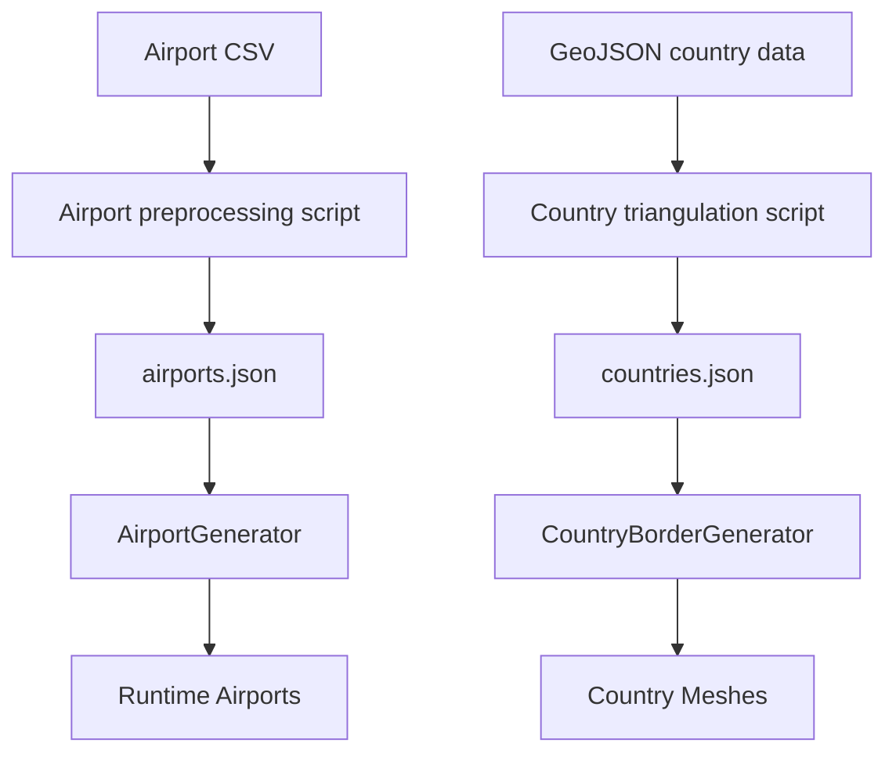
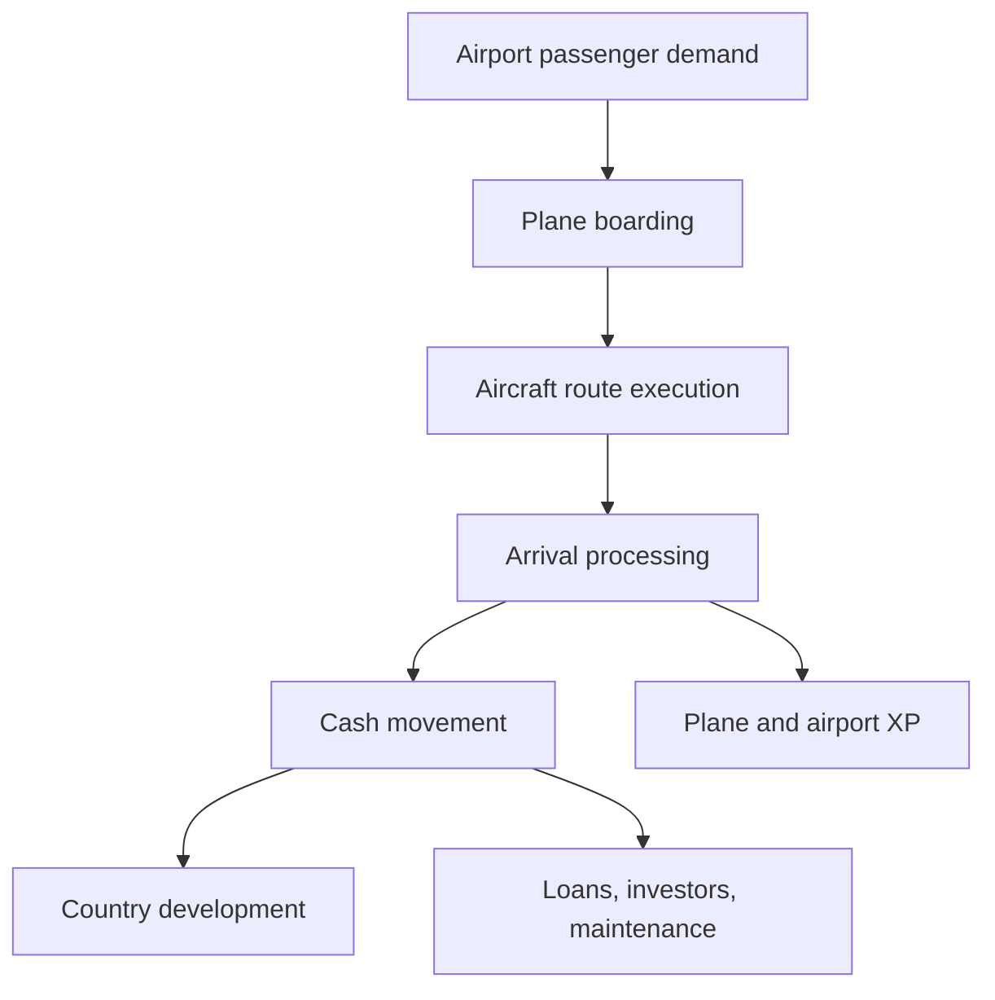

# Transit Empire Architecture

Transit Empire is a data-driven airline management simulation built in Unity with C#.

The project models an airline operation as a runtime simulation composed of world generation, airport networks, autonomous aircraft, financial systems, persistence, and contextual UI controllers.

This document describes the high-level architecture of the project from a software engineering perspective.

## Architectural Summary

Transit Empire uses a centralized orchestration model.

The simulation is coordinated by `GameManager`, while specialized managers and runtime entities handle persistence, finance, world generation, fleet operations, UI flows, notifications, audio, localization, and input.

The project was developed as a functional prototype, so some responsibilities are intentionally centralized. The architecture is best understood as a system of cooperating runtime modules around a central simulation coordinator.

## High-Level Layers



## Core Orchestration

| Component | Responsibility |
|---|---|
| `GameManager` | Coordinates global simulation state, money, time, airport ownership, fleet actions, route creation, reputation, and runtime flags |
| `SaveManager` | Serializes and restores the complete simulation state using JSON save slots |
| `LoanManager` | Creates loan and investor offers, stores active financial obligations, and exposes debt state to the simulation |
| `RouteManager` | Controls the route UI flow and delegates route creation to `GameManager` |
| `AirportGenerator` | Builds runtime airport and country objects from JSON data |
| `CountryBorderGenerator` | Builds country meshes, borders, colliders, labels, and map interaction objects |

## Runtime Domain Model

| Component | Responsibility |
|---|---|
| `Country` | Represents a territory with purchase state, development progress, airport reveal thresholds, and aggregate metrics |
| `Airport` | Represents an airport node with passenger demand, capacity, routes, reputation, maintenance, XP, and infrastructure progression |
| `AirportGarage` | Stores the local aircraft inventory for an airport |
| `Plane` | Represents an autonomous aircraft entity with a state machine, route execution, revenue calculation, wear, repair, and progression |

## Service Layer

| Component | Responsibility |
|---|---|
| `NotificatorManager` | Global notification service for system feedback |
| `AudioManager` | Music and sound effect service |
| `Globalsettings` | Stores persistent user preferences such as language, autosave, and notifications |
| `Textexporter` | Applies EN/ES localization dictionaries per scene |
| `PlaneSpritesManager` | Resolves aircraft sprites and skins by aircraft type |
| `JsonHelper` | Provides Unity-compatible JSON array parsing |
| `GlobalButtonSound` | Adds click sound listeners to active UI buttons |
| `SafeAreaFit` | Adjusts UI layout for mobile safe areas |

## UI Controllers

Transit Empire uses multiple UI controllers, each responsible for a specific operational context.

| Component | Responsibility |
|---|---|
| `InformationMain` | Main simulation HUD with money, date, reputation, routes, passengers, autonomy, and speed |
| `AirportInformationUiManager` | Airport inspection interface and navigation hub |
| `InformationManager` | Aircraft action panel for purchase, equip, delete, route assignment, maintenance, and upgrades |
| `CountryUIManager` | Country purchase and country status interface |
| `GarageManager` | Builds aircraft lists depending on garage, equipped, route, or route-fleet mode |
| `PlaneShopPanel` | Builds the aircraft purchase catalog |
| `RtBuyUi` | Confirms route purchase cost and destination |
| `MantenimientoManager` | Lists airports with maintenance debt and triggers payments |
| `SaveSlots` | Selects save/load slots |

## World Generation Architecture

Transit Empire uses preprocessed data files to build the runtime world.



The world generation system produces:

- Country containers
- Airport objects
- Airport purchase buttons
- Country borders
- Country meshes
- Country colliders
- Country labels
- Runtime map interaction handlers

## Simulation Flow



The main simulation loop connects:

- Airport passenger generation
- Aircraft route execution
- Revenue calculation
- Airport and aircraft progression
- Country development
- Debt and investor payments
- Maintenance costs
- Reputation changes
- Save/load persistence

## Persistence Architecture

The save system stores simulation state as JSON.

`SaveManager` captures runtime state into serializable DTOs:

| DTO | Purpose |
|---|---|
| `GameSave` | Root save object containing global state, loans, countries, airports, and planes |
| `CountrySave` | Stores country ownership and development state |
| `AirportSave` | Stores airport infrastructure, routes, passengers, reputation, and maintenance state |
| `PlaneSave` | Stores aircraft stats, route state, durability, XP, economy history, and state machine state |

Loading is performed through a multi-pass reconstruction process:

1. Regenerate the world
2. Build airport lookup by name
3. Restore global state
4. Restore financial state
5. Restore countries
6. Restore airports
7. Restore routes
8. Restore passenger maps
9. Recreate and assign aircraft

## Main Architectural Pattern

The project follows a practical centralized simulation architecture:

```text
Data preprocessing
→ Runtime world generation
→ Domain entities
→ Central orchestration
→ UI controllers and services
→ JSON persistence
```

This structure allowed the project to support a large simulated world, persistent progression, autonomous aircraft operations, route metrics, and financial systems inside a Unity runtime prototype.

## Engineering Value

Transit Empire demonstrates several software engineering concepts:

- Data-driven world generation
- Runtime object graph reconstruction
- Autonomous entity state machines
- Multi-pass save/load restoration
- Financial simulation
- Route network simulation
- Contextual UI controllers
- Localization service
- Service-style managers
- External preprocessing pipeline
- Mobile and desktop input support
