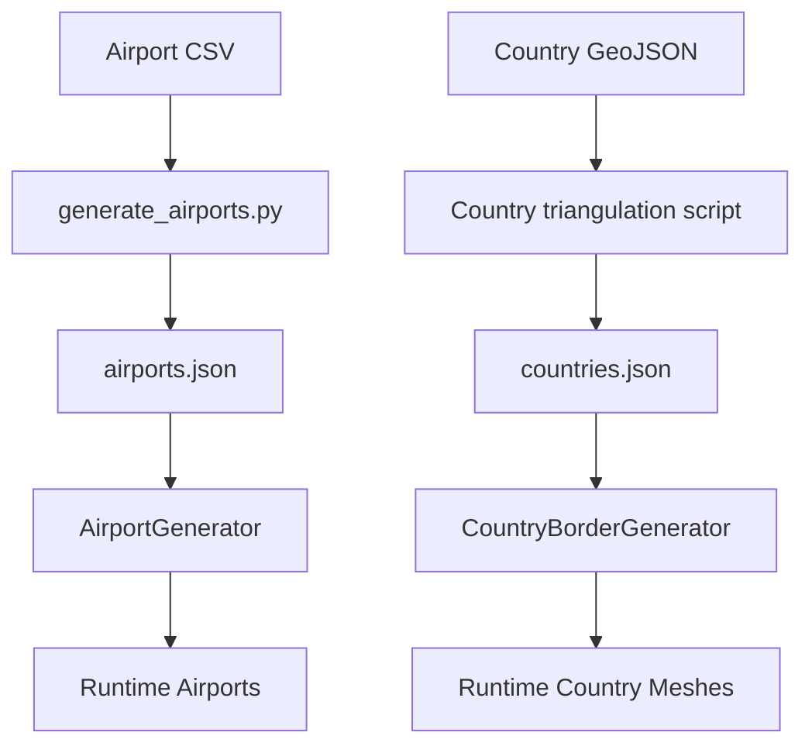

# Data Pipeline

Transit Empire uses an external data preprocessing pipeline to convert real-world airport and country geography data into Unity-ready JSON files.

This pipeline allows the simulation world to be generated from structured datasets instead of being manually placed object by object inside Unity.

## Pipeline Overview



## Main Pipeline Outputs

| Output File | Used By | Purpose |
|---|---|---|
| `airports.json` | `AirportGenerator` | Defines airport name, coordinates, country, continent, type, and multipliers |
| `countries.json` | `CountryBorderGenerator` | Defines country geometry, mesh triangles, border points, colors, and continent mapping |

## Airport Preprocessing

The airport preprocessing script converts external airport data into a balanced simulation dataset.

The script reads airport records and assigns each airport into a simulation type:

| Airport Type | Internal Value | Meaning |
|---|---:|---|
| Regional | `0` | Smaller airport, local demand behavior |
| Capital / Hub | `1` | Medium airport, broader route potential |
| International | `2` | Large airport, high-value network node |

## Airport Balancing

The airport generation script applies global distribution targets.

It uses a controlled ratio of:

- International airports
- Capital/hub airports
- Regional airports

This prevents the generated world from being dominated by one airport type and keeps the simulation strategically useful.

The script also applies country profiles such as:

- Large countries
- Medium countries
- Small countries
- High-density countries

These profiles help determine minimum airport counts and airport type distribution.

## Airport Dataset Fields

Each generated airport entry includes:

```text
airportName
x
y
continent
country
CountryPriceMultiplier
PassMultiplier
airportType
multiplierssecond
```

These fields are later consumed by `AirportGenerator`.

## Airport Runtime Usage

At runtime, `AirportGenerator` reads `airports.json` and creates Unity objects.

For each airport record, it configures:

- Airport name
- Airport coordinates
- Airport type
- Country assignment
- Continent assignment
- Base price
- Maintenance base cost
- Passenger multiplier
- Airport sprite
- Collider
- Purchase button
- Runtime `Airport` component

The generated airport is then added to:

```csharp
GameManager.Instance.AllAirports
```

## Country Geometry Preprocessing

The country preprocessing script converts GeoJSON country polygons into Unity-ready geometry.

For each supported country, the script extracts:

- Country name
- Continent
- Border points
- Triangulated mesh data
- Randomized display color

The result is written into `countries.json`.

## Country Dataset Fields

Each generated country entry includes:

```text
country
continent
color
points
triangles
```

The `points` array is used for borders and colliders.

The `triangles` array is used to create filled country meshes.

## Country Runtime Usage

At runtime, `CountryBorderGenerator` reads `countries.json` and creates:

- Country visual object
- `LineRenderer` border
- Mesh vertices
- Mesh triangles
- `MeshFilter`
- `MeshRenderer`
- `PolygonCollider2D`
- Country text label
- `CountryClickHandler`

This builds both the visual and interactive country layer.

## Data-To-Simulation Flow

```text
External data
→ Python preprocessing
→ JSON resources
→ Unity runtime generation
→ Simulation entities
→ Save/load persistence
```

## Why This Matters

The data pipeline gives Transit Empire a much larger world than would be practical to create manually.

It supports:

- Thousands of airport entries
- Country-level map geometry
- Runtime object creation
- Simulation-ready country and airport metadata
- Expansion through generated data instead of manual scene placement

## Technical Value

The data pipeline demonstrates:

- Offline preprocessing
- Dataset normalization
- Runtime data-driven generation
- GeoJSON-to-mesh conversion
- Airport classification
- Country and continent mapping
- Separation between raw data and Unity runtime objects

This is one of the strongest engineering elements of Transit Empire because it connects external datasets to a dynamic simulation world.
