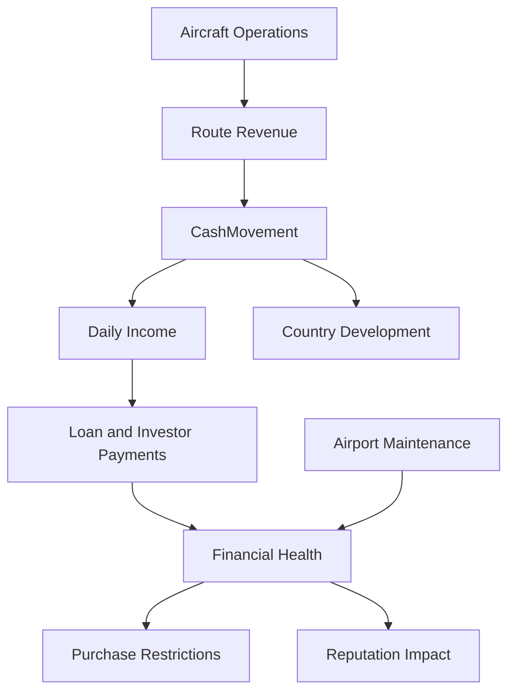

# Economy System

Transit Empire includes a layered economy model that connects aircraft operations, airport ownership, loans, investors, maintenance, reputation, autonomy, and financial penalties.

The economy is not isolated in a single component. It is distributed across `GameManager`, `Plane`, `LoanManager`, `Airport`, `Country`, and `MantenimientoManager`.

## Economy Overview



## Core Money Controller

`GameManager.CashMovement(float amount)` is the central method for money changes.

It updates:

- Current money
- Total earned
- Total spent
- Daily income
- Cash movement audio feedback

Positive values represent income. Negative values represent expenses.

This method is used by several systems, including:

- Aircraft revenue
- Plane purchase
- Airport purchase
- Country purchase
- Route purchase
- Loan payout
- Loan repayment
- Investor payout
- Maintenance payment

## Revenue Generation

Aircraft revenue is calculated by `Plane` during arrival processing.

Revenue depends on:

| Factor | Meaning |
|---|---|
| Passenger count | Number of direct and connection passengers transported |
| Aircraft type | Different aircraft types have different base ticket values |
| Distance | Longer routes can increase ticket value but also increase fuel cost |
| Load factor | Passenger load affects ticket multiplier |
| Reputation | Airport reputation affects revenue quality |
| Fuel consumption | Higher consumption reduces profit |
| Aircraft health | Low HP reduces efficiency |
| Maintenance mode | Can reduce output while improving durability |
| Event multiplier | Allows external modifiers |

After calculation, revenue is sent to:

```csharp
GameManager.Instance.CashMovement(cash);
```

## Expenses

Transit Empire includes several expense categories:

| Expense | Source |
|---|---|
| Aircraft purchase | `GameManager.BuyPlane()` |
| Airport purchase | `GameManager.BuyAirPortFunction()` |
| Country purchase | `GameManager.BuyCountry()` |
| Route creation | `GameManager.CreateRoute()` |
| Maintenance payment | `GameManager.Deuda()` |
| Loan payment | `GameManager.AdvanceDay()` |
| Investor payment | `GameManager.AdvanceDay()` |
| Aircraft repair | `Plane.HandleRepair()` |

## Loan System

`LoanManager` creates and stores financial obligations.

The actual daily processing is handled by `GameManager.AdvanceDay()`.

This creates a split responsibility:

```text
LoanManager = creates and stores financial products
GameManager = applies daily simulation effects
```

## Loan Types

| Loan Type | Description |
|---|---|
| PerCapita | Loan offers based on current company money |
| PerAvg | Loan offers based on average aircraft/route earnings |
| Investors | Capital offers exchanged for a percentage of company income |

## PerCapita Loans

PerCapita loans are calculated from the current money value.

They store:

- Remaining amount
- Daily payment
- Automatic payment flag
- Bank name

When automatic payment is disabled or money is insufficient, the financial penalty system is affected.

## PerAvg Loans

PerAvg loans are based on average aircraft route income.

They scale with operational performance. A stronger airline can access larger revenue-based loan offers.

## Investors

Investors provide immediate capital, but reduce autonomy.

Investor flow:

```text
Investor accepted
→ Money increases
→ Autonomy decreases
→ A percentage of daily income is paid back
→ Investor balance decreases
→ Autonomy is restored after repayment
```

This creates a tradeoff between expansion speed and ownership control.

## Financial Health

`LoanManager.PenaltyUmbrall` represents the company’s financial health.

It affects global restrictions and multipliers.

Low financial health can trigger:

- Reduced cash multipliers
- Reduced passenger multipliers
- Blocked plane purchases
- Blocked country purchases
- Blocked airport purchases
- Reputation loss
- Aircraft seizure
- Government intervention

## Purchase Restrictions

`GameManager.CalcUmbrall()` applies restrictions based on financial health.

| Condition | Possible Effect |
|---|---|
| Medium penalty | Reduced income/passenger multipliers |
| Low penalty | Purchase restrictions |
| Very low penalty | Aircraft seizure |
| Critical penalty | Government intervention |

This system connects debt behavior directly to operational freedom.

## Airport Maintenance

Airport maintenance is calculated monthly.

`Airport.CalcMensualCost()` accumulates maintenance debt based on:

- Base airport maintenance cost
- Airport level
- Maintenance percentage
- Unpaid month count
- Protection state

Unpaid maintenance is stored in:

```csharp
Airport.MoneyForMaintenanceUi
```

`MantenimientoManager` displays airports with outstanding maintenance debt and calls:

```csharp
GameManager.Instance.Deuda(ap);
```

to pay it.

## Reputation

Global reputation is calculated in `GameManager.CalcReputation()`.

It considers:

- Number of owned airports
- Unpaid airport maintenance
- Consecutive airport payments
- Route slots
- Aircraft profitability
- Average route income

Reputation affects:

- Loan capacity
- Financial trust
- System feedback
- Long-term airline health

## Net Worth

`GameManager.CalcNetWorth()` calculates company value from:

- Current money
- Airport resale value
- Aircraft resale value

This value is used by financial systems to evaluate debt pressure.

## Economy Loop

```text
Buy country
→ reveal airports
→ buy airport
→ buy aircraft
→ create route
→ aircraft earns revenue
→ pay loans and maintenance
→ improve reputation
→ unlock larger financial capacity
→ expand further
```

## Technical Value

The economy system demonstrates:

- Multi-source income and expense handling
- Daily financial simulation
- Debt state tracking
- Investor ownership model
- Maintenance cost pressure
- Reputation-based financial scaling
- Purchase restriction rules
- Operational performance feeding into economic progression

The result is a simulation where expansion, debt, reputation, and operational efficiency are interconnected.
