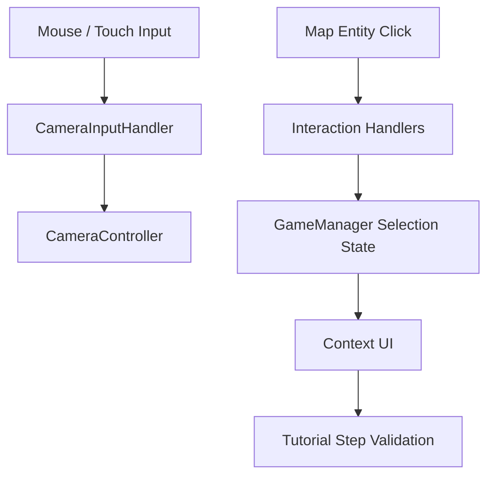

# Input And Onboarding System

Transit Empire supports both desktop and mobile-style interaction through a separated input layer, map navigation controller, interaction handlers, and a guided tutorial flow.

This document covers how the player navigates the map, selects runtime entities, and progresses through the first operational workflow.

## System Overview



## Main Components

| Component | Responsibility |
|---|---|
| `CameraInputHandler` | Reads mouse, touch, pan, scroll, and pinch input |
| `CameraController` | Applies camera panning, zooming, smoothing, and map bounds |
| `CountryClickHandler` | Detects country double-click selection |
| `AirportActivator` | Handles clicks on visible unowned airports |
| `AirPortBuyPlanes` | Handles clicks on active airports |
| `PlaneUi` | Handles clicks on aircraft objects |
| `tutorial` | Controls guided onboarding steps |
| `CountryBorderGeneratorTutorial` | Builds a reduced tutorial map |

## Input Abstraction

`CameraInputHandler` converts raw desktop and mobile input into a small data object.

```csharp
public struct InputData
{
    public bool panning;
    public Vector2 panScreenPos;
    public bool panBegan;
    public float zoomDelta;
}
```

This separates input detection from camera movement.

Supported inputs:

| Input | Behavior |
|---|---|
| Left mouse drag | Map pan |
| Mouse wheel | Zoom |
| One finger touch | Map pan |
| Two finger pinch | Zoom |

## Camera Navigation

`CameraController` consumes `CameraInputHandler.InputData`.

It handles:

- Screen-to-world pan conversion
- Smooth orthographic zoom
- Logarithmic-feeling zoom scaling
- Map boundary clamping

Navigation constraints are configured through:

```text
zoomMin
zoomMax
boundMinX
boundMaxX
boundMinY
boundMaxY
```

This allows the map to behave consistently across desktop and mobile input.

## Map Interaction Handlers

Map entities use small click handlers to route interaction into the simulation.

| Handler | Target |
|---|---|
| `CountryClickHandler` | Selects a country and opens country UI |
| `AirportActivator` | Opens airport purchase UI for visible airports |
| `AirPortBuyPlanes` | Opens airport UI or selects route destination |
| `PlaneUi` | Opens aircraft information UI |

These handlers update selection state through `GameManager`.

Examples:

```text
SetCurrentCountry()
SetCurrentAirport()
SetSelectedGaragePlane()
AirportDestiny()
```

## Country Selection

`CountryClickHandler` uses double-click detection.

Flow:

```text
Double click country mesh
→ GameManager.SetCurrentCountry()
→ Country UI opens
```

This allows the generated country mesh/collider layer to act as the territory selection surface.

## Airport Interaction

Airports have two major interaction states:

| State | Handler |
|---|---|
| Visible but unowned | `AirportActivator` |
| Purchased/active | `AirPortBuyPlanes` |

For active airports, behavior depends on route mode.

```text
If RouteMode is false:
    open airport interface

If RouteMode is true:
    use clicked airport as route destination
```

## Aircraft Interaction

`PlaneUi` allows aircraft inspection directly from the map.

Flow:

```text
Click aircraft
→ GameManager.PlaneFlying(true)
→ GameManager.SelectedGaragePlane = aircraft
→ InformationManager opens
```

This connects runtime aircraft objects back into the same aircraft information panel used by shop, garage, and route flows.

## Tutorial System

`tutorial` implements a linear onboarding state machine.

It tracks:

- Current step
- Total steps
- Main tutorial text
- Step counter
- Arrow position
- Arrow orientation
- Exit button
- Tutorial mode flag

## Tutorial Step Validation

Other scripts advance the tutorial by calling:

```csharp
tutorial.Instance.StepsValidator(step);
```

The tutorial only advances if the provided step matches the current tutorial step.

```text
Player performs expected action
→ System calls StepsValidator(expectedStep)
→ If expectedStep == current step
→ Tutorial advances
```

This creates an observer-like onboarding flow without requiring the tutorial system to own every interaction.

## Tutorial Flow

The tutorial guides the user through the first complete operational loop:

```text
1. Open main interface
2. Buy a country
3. Buy an airport
4. Open airport interface
5. Buy an aircraft
6. Open garage
7. Equip aircraft
8. Create a route
9. Assign aircraft to route
10. Observe functional route
```

## Tutorial Map Generation

`CountryBorderGeneratorTutorial` extends the regular country border generation flow.

It limits generated countries to a smaller tutorial set, such as:

```text
Germany
Poland
France
```

This reduces complexity during onboarding while reusing the same world generation architecture.

## Input And Onboarding Summary

```text
CameraInputHandler = raw input abstraction
CameraController = map navigation
Interaction handlers = entity selection
GameManager = selected runtime state
Context UI = action interface
tutorial = guided step validation
```

## Technical Value

This system demonstrates:

- Input abstraction for mouse and touch
- Mobile pinch zoom support
- Camera bounds and smooth zooming
- Map entity interaction handlers
- Selection state routed through a central coordinator
- Guided onboarding through step validation
- Reuse of world generation for tutorial mode

The onboarding system is simple, but it connects the entire first-user experience to the same runtime systems used in the full simulation.
