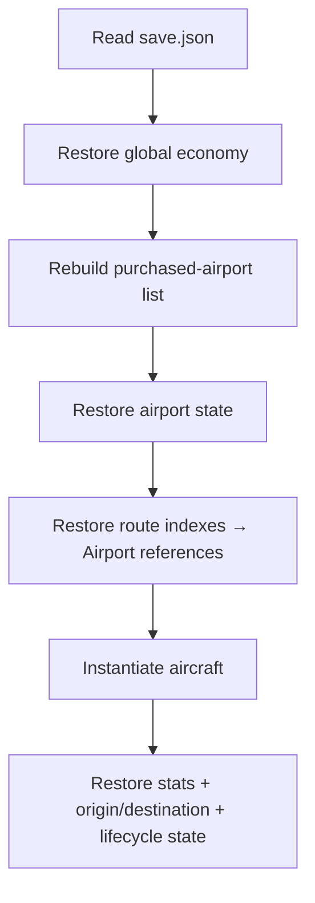

# Persistence

Transit Empire uses a local JSON save written with Unity `JsonUtility`.

```csharp
savePath = Application.persistentDataPath + "/save.json";
```

The implementation is intentionally simple: one save file, no schema version, no migration framework, and no cloud synchronization.

## Save Model

The root record contains:

```text
money
days
total earned
total spent
purchased airport snapshots
plane snapshots
```

### Airport Snapshot

For each airport in the purchased-airport list, the save stores values such as:

```text
list position
airport name
active state
level / XP / stat points
runway capacity
route-slot capacity
reputation
passenger capacity
route destination indexes
```

The current implementation stores route references as indexes into `GameManager.AllAirports`.

### Aircraft Snapshot

For each equipped aircraft, the save records:

```text
name and type
base stat values
resolved speed / consumption / capacity / range / reliability
HP / wear / age
level / XP / stat points
trip history
origin airport index
destination airport index
current lifecycle state
```

## Reconstruction Flow

Unity object references cannot be restored directly from plain JSON, so load is split into passes.



This is the most important persistence idea in the prototype: persist identifiers/indexes first, then reconstruct runtime references after the generated world exists.

## What the Save Does Not Guarantee

The implementation should not be described as a production persistence layer. Important limitations include:

- no schema/version field;
- no migrations for older records;
- a single local slot;
- no atomic temp-file swap or corruption recovery;
- airport lookup partially depends on names/list ordering;
- not every transient runtime structure is serialized;
- no automated persistence test suite.

For example, demand dictionaries and every piece of route runtime telemetry are not comprehensively persisted in the archived implementation.

## How I Would Redesign It

A rewrite would use stable IDs and an explicitly versioned save contract:

```text
SaveEnvelope
  schemaVersion
  gameState
  airportsById
  routesById
  aircraftById
```

Loading would then be organized as:

```text
parse
→ validate
→ migrate if required
→ construct plain domain state
→ bind Unity views/runtime objects
```

That would remove dependence on list positions and make persistence testable outside the Unity scene.
