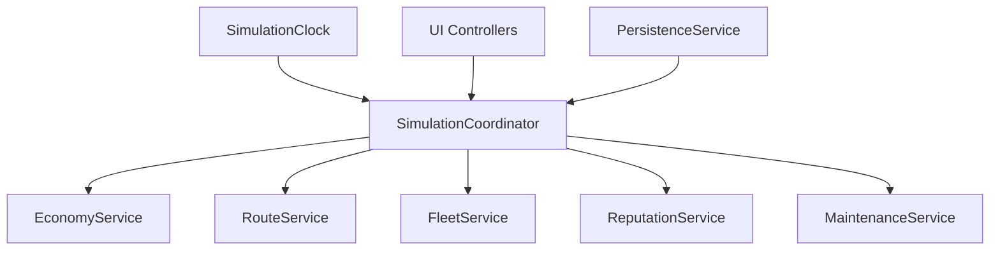

# Refactor Roadmap

This document outlines possible refactor opportunities for Transit Empire.

Transit Empire is a functional Unity/C# simulation prototype. The current implementation prioritizes working systems and end-to-end behavior. This roadmap describes how the project could be reorganized if it were evolved into a more maintainable production-style architecture.

This is not a list of required fixes. It is a technical roadmap for future improvement.

## Refactor Goals

The main goals of a refactor would be:

- Reduce responsibility concentration in `GameManager`
- Separate simulation logic from UI logic
- Move financial rules into dedicated services
- Make route and fleet operations easier to test
- Improve persistence boundaries
- Reduce direct singleton coupling
- Create clearer domain models
- Improve long-term maintainability

## Current Architecture Summary

Current high-level structure:

```text
GameManager
├── Simulation time
├── Money
├── Airport ownership
├── Plane purchase/equip/delete
├── Route creation/deletion
├── Loan execution
├── Reputation
├── Maintenance payment
├── UI mode flags
└── Global metrics
```

This worked well for a prototype, but several responsibilities could become independent systems.

## Target Architecture Direction

A future architecture could move toward this structure:



## Priority 1: Split GameManager Responsibilities

`GameManager` should eventually become a thinner coordinator.

### Candidate Extractions

| Current Responsibility | Suggested Component |
|---|---|
| Time and date | `SimulationClock` |
| Money movement | `EconomyService` |
| Plane purchase/equip/delete | `FleetService` |
| Route creation/deletion | `RouteService` |
| Airport purchase | `AirportOwnershipService` |
| Country purchase | `CountryOwnershipService` |
| Reputation calculation | `ReputationService` |
| Loan daily processing | `FinanceSimulationService` |
| Maintenance payment | `MaintenanceService` |
| UI flags | `UIStateService` |

### Expected Benefit

This would make each system easier to reason about, test, and document.

## Priority 2: Create A Simulation Coordinator

Instead of placing all logic in `GameManager`, a smaller coordinator could call specialized services.

Example responsibility:

```text
SimulationCoordinator
├── Advance day
├── Notify economy systems
├── Notify maintenance systems
├── Notify reputation systems
├── Trigger autosave
└── Keep high-level state flow readable
```

This keeps orchestration central while reducing business logic concentration.

## Priority 3: Separate UI From Domain Logic

Many UI scripts currently call `GameManager` directly.

Current pattern:

```text
Button click
→ UI controller
→ GameManager
→ Domain object mutation
```

Possible improved pattern:

```text
Button click
→ UI controller
→ Application service
→ Domain object mutation
→ UI refresh
```

### Candidate Services

| UI Area | Suggested Service |
|---|---|
| Plane shop | `FleetService` |
| Route UI | `RouteService` |
| Country UI | `CountryOwnershipService` |
| Airport UI | `AirportService` |
| Loan UI | `FinanceService` |
| Maintenance UI | `MaintenanceService` |

## Priority 4: Extract Aircraft Logic

`Plane` currently handles many responsibilities:

- Movement
- Boarding
- Passenger selection
- Revenue calculation
- Fuel cost calculation
- Wear and reliability
- XP
- Route metrics
- Visual state

Possible extractions:

| Current Plane Area | Suggested Component |
|---|---|
| Revenue calculation | `RevenueCalculator` |
| Passenger loading | `PassengerBoardingService` |
| Wear and repair | `AircraftMaintenanceModel` |
| Bezier movement | `AircraftMovementController` |
| XP/stat progression | `AircraftProgressionModel` |
| Route metrics | `RouteMetricsTracker` |

This would make aircraft behavior easier to tune.

## Priority 5: Extract Airport Demand Logic

`Airport` currently handles:

- Passenger generation
- Demand distribution
- Capacity enforcement
- Reputation penalty
- Upgrade logic
- Maintenance state
- Visual occupancy state

Possible extractions:

| Current Airport Area | Suggested Component |
|---|---|
| Passenger generation | `DemandGenerator` |
| Destination selection | `DestinationSelector` |
| Capacity enforcement | `CapacityLimiter` |
| Reputation changes | `AirportReputationModel` |
| Upgrades | `AirportProgressionModel` |
| Maintenance | `AirportMaintenanceModel` |

## Priority 6: Improve Financial System Boundaries

`LoanManager` currently handles both financial state and UI generation.

A cleaner structure could be:

```text
FinanceService
├── Create loan offers
├── Accept loan
├── Accept investor
├── Process daily payments
├── Process penalties
└── Calculate loan limits

LoanUIController
├── Render loan offers
├── Render investor offers
├── Render active loans
└── Bind buttons
```

This would separate financial rules from UI construction.

## Priority 7: Centralize UI State

Current UI mode flags live inside `GameManager`.

Examples:

```text
IsGarage
equip
routeequiping
floating
flying
RouteMode
CanTouchUi
MainUiHidden
```

These could move into:

```text
UIStateService
```

or a small state machine:

```text
enum InteractionMode
{
    Default,
    AirportInfo,
    PlaneShop,
    Garage,
    Equipping,
    RouteCreation,
    RouteAssignment,
    RouteFleet,
    FlyingPlaneInspection
}
```

This would reduce invalid UI states.

## Priority 8: Improve Persistence Versioning

`SaveManager` already uses DTOs, which is good.

Future improvements could include:

- Save version field
- Migration logic
- Validation before loading
- Missing reference recovery
- Separate save DTO files
- Dedicated mappers per entity

Possible structure:

```text
Persistence/
├── GameSave.cs
├── AirportSave.cs
├── PlaneSave.cs
├── CountrySave.cs
├── SaveMapper.cs
├── SaveValidator.cs
└── SaveMigration.cs
```

## Priority 9: Replace Direct Singleton Access Gradually

Singletons are practical in Unity prototypes, but heavy usage makes systems tightly coupled.

Current examples:

```text
GameManager.Instance
SaveManager.Instance
AudioManager.Instance
NotificatorManager.Instance
PlaneSpritesManager.Instance
```

A future architecture could pass references through:

- Inspector dependencies
- Constructor-like setup methods
- Service locator with interfaces
- ScriptableObject configuration
- Event channels

This does not need to be done all at once.

## Priority 10: Add Event-Based Feedback

Many systems directly call `NotificatorManager`.

Current pattern:

```text
Domain logic
→ NotificatorManager.CreateNotifications()
```

Possible future pattern:

```text
Domain logic
→ Domain event
→ Notification listener
→ UI notification
```

Example events:

```text
AirportPurchased
PlanePurchased
RouteCreated
LoanApproved
InvestorAccepted
MaintenanceDue
AircraftOutOfService
ReputationChanged
```

This would reduce coupling between simulation logic and UI feedback.

## Suggested Refactor Order

Recommended order if the project is refactored:

1. Create `SimulationClock`
2. Extract `EconomyService`
3. Extract `RouteService`
4. Extract `FleetService`
5. Extract `UIStateService`
6. Split `LoanManager` into finance logic and finance UI
7. Extract aircraft revenue/wear logic
8. Extract airport demand logic
9. Add save versioning
10. Add event-based notifications

## What Should Not Be Refactored First

Avoid starting with:

- Full clean architecture rewrite
- Replacing all singletons at once
- Rewriting every UI controller
- Changing save format before stabilizing mappers
- Rebuilding world generation from scratch

Those would create high risk without immediate value.

## Practical Refactor Strategy

The safest strategy is incremental extraction.

Example:

```text
Before:
GameManager.CreateRoute()

After:
RouteService.CreateRoute(origin, destination)
GameManager delegates to RouteService
UI still calls GameManager temporarily
```

This allows the system to improve without breaking existing UI flows.

## Portfolio Interpretation

For portfolio documentation, the important point is not that the current architecture is perfect.

The important point is that the project has identifiable boundaries and a realistic path toward better architecture.

This shows engineering maturity:

- Understanding the current system
- Identifying coupling
- Preserving working behavior
- Planning incremental improvements
- Avoiding unnecessary rewrites

## Summary

Transit Empire’s refactor path is clear:

```text
Centralized prototype
→ Service extraction
→ UI/domain separation
→ Event-based feedback
→ Versioned persistence
→ More testable simulation modules
```

The current version is valuable because it proves the full simulation loop works. A refactor would focus on maintainability, not on replacing the core design.
