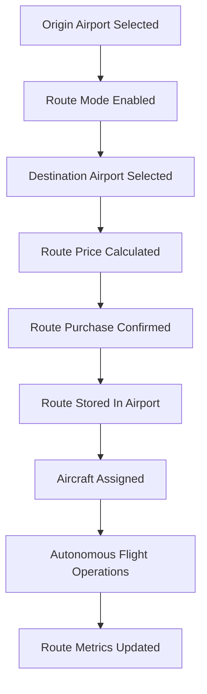

# Route System

Transit Empire models airline routes as connections between owned airports. Routes define where aircraft can operate, how passenger demand is consumed, and how operational metrics are tracked.

The route system is distributed across `GameManager`, `RouteManager`, `RtBuyUi`, `Airport`, `GarageManager`, and `Plane`.

## Route System Overview



## Main Components

| Component | Responsibility |
|---|---|
| `GameManager` | Owns route creation logic, selected origin, selected destination, route price, aircraft assignment, and route deletion |
| `RouteManager` | Controls route UI flow, route list creation, route selection, and route metrics display |
| `RtBuyUi` | Displays route price/distance and confirms route purchase |
| `Airport` | Stores routes, inbound routes, passenger demand, route slots, and historical route statistics |
| `GarageManager` | Displays aircraft that can be assigned to a selected route |
| `Plane` | Executes the route operationally and records trip metrics |

## Route Data Model

Routes are stored on the origin airport.

```csharp
public List<Airport> routes;
public List<Airport> inboundRoutes;
public Dictionary<Airport, int> passengersByRoute;
public Dictionary<Airport, RouteStats> routeStats;
```

This means each airport owns its outgoing route list and maintains destination-specific passenger demand.

## Route Creation Flow

The route creation flow starts when the user opens the route interface for a selected airport.

1. `GameManager.CurrentAirport` stores the origin airport.
2. `RouteManager` enables route mode.
3. The user clicks another owned airport.
4. `AirPortBuyPlanes` detects that route mode is active.
5. `GameManager.AirportDestiny()` stores the destination.
6. `GameManager.CreateRtPrice()` calculates route cost.
7. `RtBuyUi` displays distance and price.
8. On confirmation, `RouteComplete(true)` is set.
9. `RouteManager.Init()` calls `GameManager.CreateRoute()`.

## Route Validation

`GameManager.CreateRoute()` validates:

- Origin airport exists
- Destination airport exists
- Origin and destination are different
- Route does not already exist
- Origin airport has available route slots

If validation passes:

- Destination is added to `current.routes`
- Origin is added to `Destination.inboundRoutes`
- Passenger route entry is initialized
- Route slots are consumed
- Money is deducted
- Global route count is incremented

## Route Price Calculation

`GameManager.CreateRtPrice()` calculates route price from:

- Distance between origin and destination
- Destination airport level
- Origin airport level
- Global route cost multiplier

The route distance is based on map coordinates and converted to miles.

```text
distance = coordinate distance * Plane.WORLD_TO_MILES
```

## Aircraft Assignment

Aircraft assignment is handled by `GameManager.AddPlaneToRoute()`.

Assignment validates:

- A selected aircraft exists
- A selected route exists
- The aircraft is not already assigned to the same route
- The origin airport has available runway capacity
- The aircraft has enough range at the UI level

When assigned:

- `Plane.cityA` is set to the origin
- `Plane.cityB` is set to the destination
- The aircraft is moved into `PlanesInRoute`
- The aircraft is removed from available equipped planes
- The aircraft begins its autonomous state machine

## Garage Route Mode

`GarageManager` has multiple list modes.

For routes, it uses:

```text
routeMod
Routefloat
```

These modes allow the UI to show:

- Aircraft available for assignment
- Aircraft already assigned to the current route
- Aircraft assigned elsewhere
- Aircraft that are out of range

This makes `GarageManager` a contextual fleet browser rather than a simple garage list.

## Route Execution

Once assigned, the aircraft handles route execution through `Plane`.

The aircraft:

1. Boards passengers from origin demand
2. Flies to the destination
3. Calculates revenue
4. Applies fuel and health penalties
5. Updates route metrics
6. Turns around
7. Repeats the route in reverse

## Passenger Demand

Passenger demand is stored per destination.

```csharp
passengersByRoute[destinationAirport]
```

During boarding, `Plane` attempts to load:

- Direct passengers for the destination
- Eligible connection passengers
- Enough passengers to pass the departure threshold

This gives each route operational dependency on airport demand.

## Route Metrics

Active route metrics are stored on aircraft:

```csharp
routeTravels
routeMoney
routePass
```

Historical route metrics are stored on the origin airport:

```csharp
Airport.routeStats[destination]
```

`RouteManager.repeatfunction()` combines active aircraft metrics and historical route stats to display:

- Route name
- Distance
- Total revenue
- Average revenue
- Total passengers
- Average passengers

## Route Deletion

`GameManager.DeleteRoute()` removes a route from the origin airport.

When a route is deleted:

- The route is removed from `Airport.routes`
- The origin is removed from destination inbound routes
- Route slots are freed
- A partial refund is calculated
- Aircraft assigned to the route are returned to the origin
- Active route metrics are transferred into historical route stats
- Aircraft route state is reset

## Route System Summary

```text
RouteManager = route UI controller
RtBuyUi = route purchase confirmation
GameManager = route transaction and assignment logic
Airport = route data owner
GarageManager = aircraft selection UI
Plane = autonomous route executor
```

## Technical Value

The route system demonstrates:

- Graph-like airport connections
- Runtime route creation and deletion
- Route slot capacity constraints
- Aircraft assignment workflow
- Passenger demand per destination
- Active and historical route metrics
- Autonomous repeated route execution
- UI-driven domain operations
