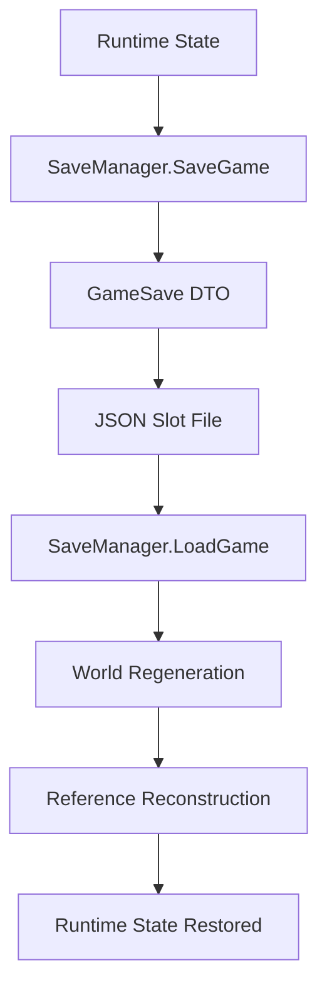

# Save System

Transit Empire uses a JSON-based persistence system to save and restore the full simulation state.

The save system is managed by `SaveManager` and exposed to the user through `SaveSlots`.

The project does not only save basic player progress. It persists the operational state of the simulation, including countries, airports, routes, passengers, aircraft, loans, investors, reputation, and global airline metrics.

## Persistence Overview



## Save Location

Save files are stored using Unity's persistent data path.

```csharp
Application.persistentDataPath + "/save_slot{slot}.json"
```

Each slot has its own file.

## Main Components

| Component | Responsibility |
|---|---|
| `SaveManager` | Serializes and restores simulation state |
| `SaveSlots` | Provides save/load slot UI |
| `GameSave` | Root DTO for saved data |
| `CountrySave` | Country state DTO |
| `AirportSave` | Airport state DTO |
| `PlaneSave` | Aircraft state DTO |

## Save Slot Flow

`SaveSlots` controls whether the user is saving or loading.

```text
Open slot panel
→ Select slot
→ SaveManager.SetSlot(slot)
→ SaveGame() or LoadGame()
```

`SaveSlots` also previews slot data by calling:

```csharp
SaveManager.PeekSlot(slot)
```

This allows the UI to display saved day, money, and reputation before loading.

## Root Save Object

The root object is `GameSave`.

It stores:

- Global airline state
- Financial state
- Country states
- Airport states
- Plane states

```csharp
public class GameSave
{
    public float money;
    public int days;
    public float totalEarned;
    public float totalSpent;

    public float globalReputation;
    public string airlineName;
    public float autonomy;

    public List<CountrySave> countries;
    public List<AirportSave> airports;
    public List<PlaneSave> planes;
}
```

## Global State Saved

`SaveManager` stores global values from `GameManager`, including:

- Money
- Days
- Total earned
- Total spent
- Global reputation
- Airline name
- Autonomy
- Embargo/intervention flags
- Route cost multiplier

## Financial State Saved

The save system persists `LoanManager` data:

- Penalty threshold
- Current loan count
- Monthly investor search attempts
- PerCapita loan balances
- PerCapita daily payments
- PerCapita auto-payment flags
- PerCapita lender names
- PerAvg loan balances
- PerAvg daily payments
- PerAvg auto-payment flags
- PerAvg lender names
- Investor balances
- Investor revenue shares
- Investor names

This allows debt and investor obligations to continue correctly after loading.

## Country State Saved

`CountrySave` stores:

- Country name
- Active state
- Total generated value
- Owned airport count
- Average reputation total
- Regional development progress
- Capital development progress
- International development progress
- Development thresholds for each airport type

Country save data preserves territorial progression and airport reveal state.

## Airport State Saved

`AirportSave` stores both infrastructure and runtime simulation state.

Saved airport data includes:

- Airport name
- Active state
- Visible state
- Airport level
- XP
- Stat points
- Max runways
- Max route slots
- Current reputation
- Max reputation
- Capacity
- Capacity level
- Used runways
- Maintenance debt
- Maintenance percentage
- Consecutive payments
- Upgrade levels
- Route names
- Passenger map keys and values

Routes and passenger demand are saved by airport name instead of direct references.

## Aircraft State Saved

`PlaneSave` stores:

- Plane name
- Plane type
- Raw stat values
- Calculated stats
- HP
- Max HP
- Wear
- Age
- Level
- XP
- Stat points
- Travel history
- Route revenue history
- Route passenger history
- Discount/penalty data
- Origin airport name
- Destination airport name
- Current state machine state
- Whether the plane is currently in route mode

This preserves aircraft progression and operational context.

## Save Flow

`SaveManager.SaveGame()` performs this process:

```text
1. Create GameSave
2. Save global GameManager state
3. Save LoanManager state
4. Find and save countries
5. Save owned airports
6. Save visible unowned airports
7. Save airport routes
8. Save passenger maps
9. Save garage aircraft
10. Save route aircraft
11. Write JSON file
```

## Load Flow

Loading is more complex than saving because Unity object references must be reconstructed.

`SaveManager.LoadGame()` starts an asynchronous load process through `LoadAfterReset()`.

The load flow is:

```text
1. Reset or regenerate world
2. Read JSON save file
3. Build airport dictionary by airport name
4. Restore global GameManager state
5. Restore LoanManager state
6. Restore Country state
7. Restore active and visible airports
8. Restore airport routes by name
9. Restore passenger maps by name
10. Instantiate aircraft
11. Restore aircraft stats and state
12. Assign aircraft to garage or active route list
```

## Multi-Pass Reconstruction

The save system uses multiple passes because entities depend on each other.

| Pass | Purpose |
|---|---|
| World generation | Ensures all countries and airports exist |
| Airport lookup | Maps airport names to runtime objects |
| Airport restore | Restores ownership and infrastructure |
| Route restore | Reconnects airport references |
| Passenger restore | Rebuilds passenger demand dictionaries |
| Plane restore | Instantiates aircraft and reconnects origin/destination |

## Reference Strategy

Unity scene references are not serialized directly.

Instead, the system saves stable names:

```text
airportName
cityAName
cityBName
routeNames
passengerKeys
```

During load, these names are resolved back into runtime objects.

This approach allows the world to be rebuilt from data and then reconnected from save data.

## Debug Support

`SaveManager` includes a debug log wrapper that writes a save/load diagnostic file.

This helps identify:

- Missing airports
- Duplicate airport names
- Null routes
- Skipped planes
- Missing country objects
- Reconstructed route counts

## Technical Value

The save system demonstrates:

- JSON save slots
- DTO-based persistence
- Multi-pass runtime reconstruction
- Reference restoration by stable identifiers
- Persistence of autonomous entity state
- Persistence of graph-like route relationships
- Persistence of financial obligations
- Persistence of world progression

Transit Empire’s save system is one of the strongest engineering parts of the project because it preserves a complex, interconnected simulation rather than a small set of player stats.
