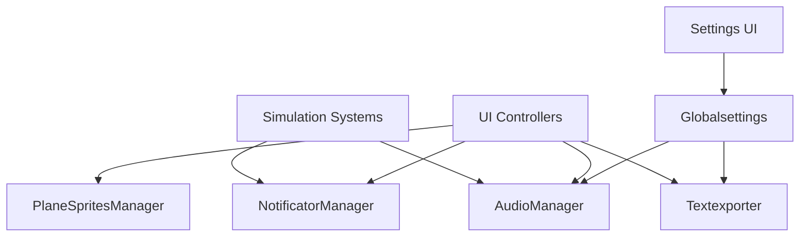

# Services System

Transit Empire includes several service-style managers that provide cross-cutting behavior across the simulation.

These services are not tied to a single domain entity. Instead, they support many different systems such as UI, notifications, audio, localization, settings, sprites, and layout.

## Service Layer Overview



## Main Services

| Service | Responsibility |
|---|---|
| `NotificatorManager` | Creates categorized runtime notifications |
| `AudioManager` | Manages music, sound effects, and volume preferences |
| `Globalsettings` | Stores user settings such as language, autosave, and notifications |
| `Textexporter` | Applies scene-specific EN/ES localization |
| `PlaneSpritesManager` | Resolves aircraft sprites and skins |
| `GlobalButtonSound` | Adds click sound behavior to active buttons |
| `SafeAreaFit` | Adjusts UI layout for mobile safe areas |
| `JsonHelper` | Parses JSON arrays into Unity-compatible objects |

## Notification Service

`NotificatorManager` provides global runtime feedback.

It is used by many systems, including:

- `GameManager`
- `Plane`
- `Airport`
- `LoanManager`
- `Country`
- `MantenimientoManager`

Notifications are grouped into categories:

| Category Index | Category |
|---:|---|
| `0` | Planes |
| `1` | Airports |
| `2` | Countries |
| `3` | Finance |
| `4` | Alerts |

Each notification includes:

- Title
- Message
- Category type
- Icon index
- Border color
- Text color
- Sound effect
- Auto-destroy timer

## Notification Flow

```text
Simulation event
→ NotificatorManager.CreateNotifications()
→ Notification prefab instantiated
→ Icon and colors assigned
→ Message displayed
→ Notification sound played
→ Notification removed after lifetime
```

The service also limits the number of visible notifications to avoid UI overflow.

## Audio Service

`AudioManager` manages two audio channels:

| Source | Purpose |
|---|---|
| `musicSource` | Background music |
| `sfxSource` | Sound effects |

It supports:

- Menu music
- Normal simulation music
- Crisis music
- Epic music
- Cash movement sound
- Airport spawned sound
- Click sounds
- Purchase sounds
- Notification sounds
- Success sounds
- Error sounds

Volume is persisted using `PlayerPrefs`.

## Settings Service

`Globalsettings` stores user preferences.

It tracks:

- Autosave enabled/disabled
- Notifications enabled/disabled
- Current language
- Menu-related flags
- Animation-related flags

Settings are saved through:

```csharp
PlayerPrefs
```

Other systems read `Globalsettings` to determine behavior.

For example:

- `GameManager` reads language through `Globalsettings.instance.Language`
- `Textexporter` applies localized text based on the selected language
- `SettingsMenu` toggles preferences
- Notification behavior can be controlled through settings

## Localization Service

`Textexporter` applies localization per scene.

It listens to:

```csharp
SceneManager.sceneLoaded
```

Then it applies a dictionary based on the active scene:

| Scene | Dictionary |
|---|---|
| Main menu | `GetDictMenu()` |
| Free mode | `GetDictFreeMode()` |
| Tutorial | `GetDictTutorial()` |

The localization process:

```text
Find all TextMeshProUGUI objects
→ Reset Spanish values back to English keys
→ Match current text against dictionary keys
→ Apply selected language
```

This approach allows UI text to be translated without requiring every UI controller to own its own dictionary.

## Sprite Service

`PlaneSpritesManager` resolves aircraft visuals.

It stores aircraft sprite entries by plane type.

Each entry can contain:

- Plane type
- Default skin
- Optional skin list

UI systems use it to display aircraft sprites consistently in:

- Plane shop
- Garage
- Aircraft information panel
- Runtime aircraft objects

## Global Button Sound

`GlobalButtonSound` scans active UI buttons and attaches a click sound listener.

This creates a centralized sound behavior for UI buttons without manually wiring every button.

The scan runs periodically instead of every frame.

## Safe Area Support

`SafeAreaFit` adjusts UI anchors and width based on device safe area.

It supports screens with notches by reading:

```csharp
Screen.safeArea
```

This improves mobile layout stability.

## JSON Helper

`JsonHelper` wraps JSON arrays so Unity’s `JsonUtility` can parse them.

Unity `JsonUtility` does not directly parse top-level arrays, so the helper wraps them internally before deserialization.

Used by:

- `AirportGenerator`
- `CountryBorderGenerator`
- Tutorial world generation

## Service Access Pattern

Most services are accessed through singletons:

```text
AudioManager.Instance
NotificatorManager.Instance
Globalsettings.instance
Textexporter.Instance
PlaneSpritesManager.Instance
```

This keeps usage simple across Unity scripts, especially in a prototype architecture.

## Technical Value

The service layer demonstrates:

- Cross-system notification handling
- Centralized audio playback
- Persistent settings
- Scene-based localization
- Visual asset lookup
- Global UI button behavior
- Mobile-safe layout support
- Unity JSON helper abstraction

These systems support the simulation without belonging to a single gameplay domain.
