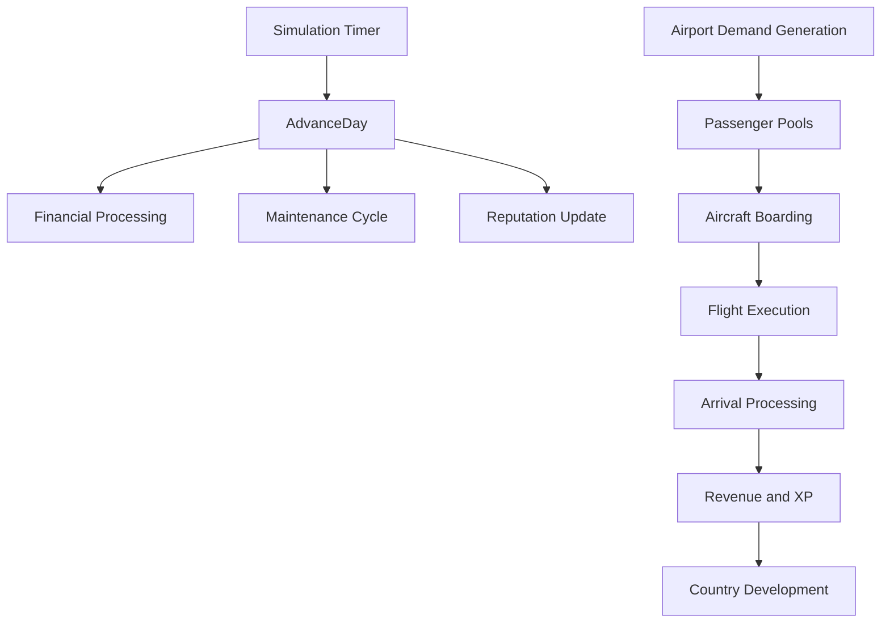
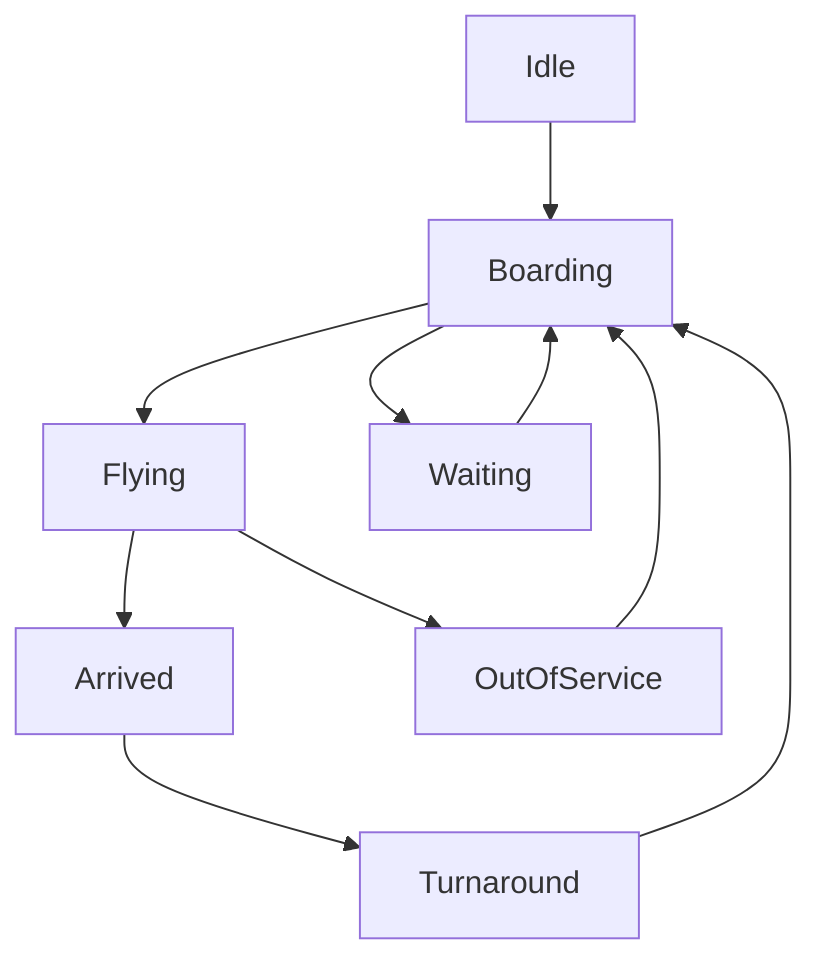

# Simulation System

Transit Empire simulates an airline operation through airports, countries, aircraft, routes, passengers, time progression, and financial feedback.

The simulation is not controlled by a single isolated loop. Instead, it emerges from multiple runtime entities coordinated by `GameManager`.

## Simulation Overview

The main simulation model is built around four active domains:

| Domain | Main Components | Purpose |
|---|---|---|
| Time | `GameManager` | Advances days, months, speed, autosave, reputation, and debt cycles |
| Airports | `Airport` | Generates passenger demand, stores route demand, manages capacity and infrastructure |
| Aircraft | `Plane` | Executes autonomous route operations through a state machine |
| Countries | `Country` | Tracks territorial development and unlocks airport expansion opportunities |

## Main Runtime Flow



## Time And Day Progression

`GameManager` controls the global simulation calendar.

It tracks:

- `Days`
- `Months`
- `Years`
- `GameSpeed`
- `Paused`
- `DayDuration`

`GameManager.Update()` advances an internal timer. When the timer reaches the configured day duration, it calls `AdvanceDay()`.

`AdvanceDay()` is responsible for:

- Advancing the date
- Processing loan payments
- Processing investor payments
- Updating financial penalties
- Triggering monthly airport maintenance
- Updating reputation
- Triggering autosave
- Resetting daily income

## Airport Demand Simulation

`Airport` is an active simulation node.

Each airport can generate passengers over time based on:

- Continent multiplier
- Country multiplier
- Airport multiplier
- Airport type
- Airport reputation
- Secondary demand multiplier
- Capacity limit

Passenger demand is stored per destination:

```csharp
Dictionary<Airport, int> passengersByRoute
```

This means airports do not store only a generic passenger count. They maintain demand mapped to possible destination airports.

## Airport Types

| Type | Meaning | Simulation Impact |
|---|---|---|
| `0` | Regional | Smaller capacity, local demand focus, slower generation |
| `1` | Capital | Medium capacity, continent-level demand behavior |
| `2` | International | Larger capacity, broader demand distribution |

Airport type affects generation interval, base capacity, runway limits, route slots, and destination selection logic.

## Aircraft State Machine

`Plane` is an autonomous runtime entity.

It uses the following operational states:

```text
Idle
Boarding
Flying
Arrived
Waiting
Turnaround
OutOfService
```

The aircraft lifecycle is:



## Boarding

During boarding, the aircraft:

- Checks origin and destination
- Validates route distance against aircraft range
- Reads passenger demand from the origin airport
- Prioritizes direct passengers
- Adds eligible connection passengers
- Updates the origin airport passenger map
- Moves into `Flying` state if minimum load is reached

## Flight Execution

During flight, the aircraft:

- Moves along a Bezier curve
- Handles long-distance map wrapping
- Applies speed based on aircraft stats and game speed
- Accumulates wear over distance
- Can suffer durability loss
- Can enter out-of-service state after critical failure

## Arrival Processing

When arriving, the aircraft:

- Redistributes some passengers into the destination airport
- Calculates route revenue
- Applies fuel cost
- Applies health and maintenance penalties
- Adds money through `GameManager.CashMovement()`
- Adds XP to the aircraft and both airports
- Updates route metrics
- Flips direction for the return trip
- Enters turnaround before boarding again

## Progression Systems

Transit Empire has progression at multiple simulation levels.

| Entity | Progression Data |
|---|---|
| Aircraft | XP, level, stat points, speed, consumption, capacity, range, reliability |
| Airport | XP, level, stat points, capacity, runways, route slots, max reputation |
| Country | Total generated value, owned airports, reveal thresholds |
| Airline | Money, reputation, autonomy, network size |

## Country Development Loop

Country development is driven by airline activity.

```text
Aircraft earns revenue
→ Country receives development value
→ Development threshold is reached
→ New airport becomes visible
→ Player can expand the network
```

This connects route performance directly to map expansion.

## Maintenance And Degradation

The simulation includes long-term operational pressure through maintenance and durability.

Aircraft track:

- HP
- Max HP
- Wear
- Age
- Reliability
- Maintenance mode
- Repair state

Airports track:

- Maintenance debt
- Consecutive payments
- Maintenance percentage
- Protection state
- Monthly accumulated cost

This creates a loop where growth increases operational burden.

## Technical Summary

The simulation system is composed of:

- Central time orchestration through `GameManager`
- Active airport demand nodes through `Airport`
- Autonomous aircraft agents through `Plane`
- Territorial expansion through `Country`
- Financial feedback through revenue, debt, maintenance, and reputation

Transit Empire’s core technical value is the interaction between these systems: route operations generate money, money drives expansion, expansion increases complexity, and complexity creates new financial and operational constraints.
