# System Flow

This document describes the main end-to-end runtime flows in Transit Empire.

The goal is to show how the major systems interact during normal simulation usage: world generation, country purchase, airport activation, route creation, aircraft assignment, flight execution, economy updates, and persistence.

## Global Flow

Transit Empire’s runtime flow can be summarized as:

```text
Generate world
→ Select country
→ Buy country
→ Reveal airports
→ Buy airport
→ Buy aircraft
→ Equip aircraft
→ Create route
→ Assign aircraft
→ Aircraft operates autonomously
→ Revenue updates economy
→ Save/load preserves state
```

## Runtime Startup Flow

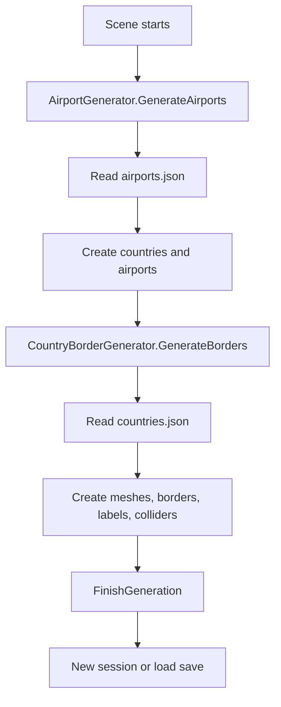

## 1. World Generation

The world is generated from data files.

### Airport Generation

`AirportGenerator` reads `airports.json` and creates:

- Country containers
- Airport objects
- Airport sprites
- Airport colliders
- Airport purchase buttons
- Airport simulation data

Each airport is registered in:

```csharp
GameManager.Instance.AllAirports
```

### Country Generation

`CountryBorderGenerator` reads `countries.json` and creates:

- Country visual mesh
- Border line
- Polygon collider
- Country label
- Country click handler

This creates both the visual map and the interactive territory layer.

## 2. Country Purchase Flow

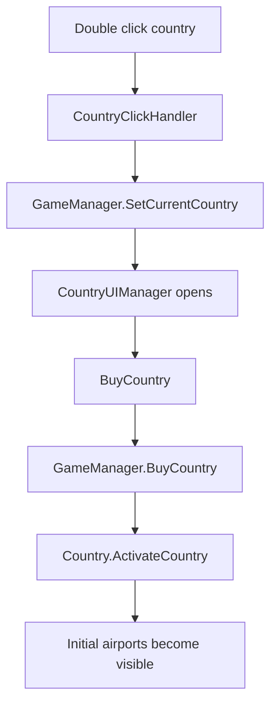

When a country is purchased:

1. The selected country is stored in `GameManager`.
2. `CountryUIManager` displays price and airport counts.
3. `GameManager.BuyCountry()` validates money and applies the transaction.
4. `Country.ActivateCountry()` reveals a starting set of airports.
5. Those airports can now be purchased.

## 3. Airport Purchase Flow

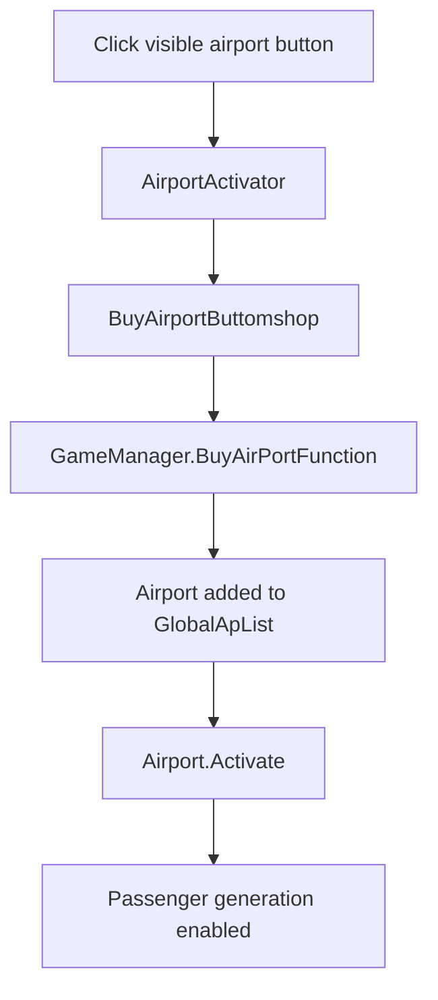

When an airport is purchased:

- Money is deducted.
- The airport is added to `GlobalApList`.
- The airport becomes active.
- Its collider and sprite are enabled.
- Passenger generation can begin.
- Other owned airports refresh possible passenger routes.

## 4. Airport Operations Flow

After an airport is active, clicking it opens the airport interface.

```text
AirPortBuyPlanes
→ GameManager.SetCurrentAirport()
→ AirportInformationUiManager
```

From the airport interface, the user can access:

- Plane shop
- Garage
- Routes
- Equip mode
- Airport upgrades

## 5. Aircraft Purchase Flow

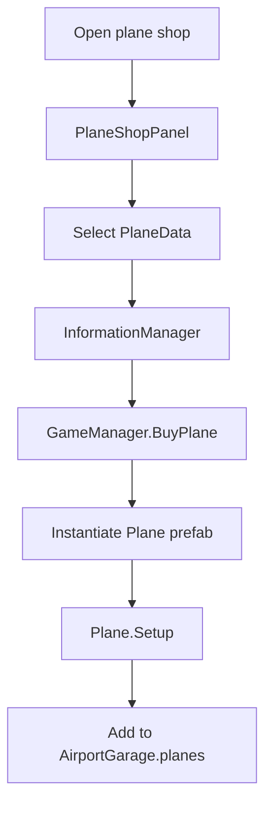

Aircraft purchase uses catalog data stored in `GameManager.PlaneData`.

When purchased:

- Money is deducted.
- A plane prefab is instantiated.
- Plane stats are initialized.
- The plane is stored in the selected airport garage.

## 6. Aircraft Equip Flow

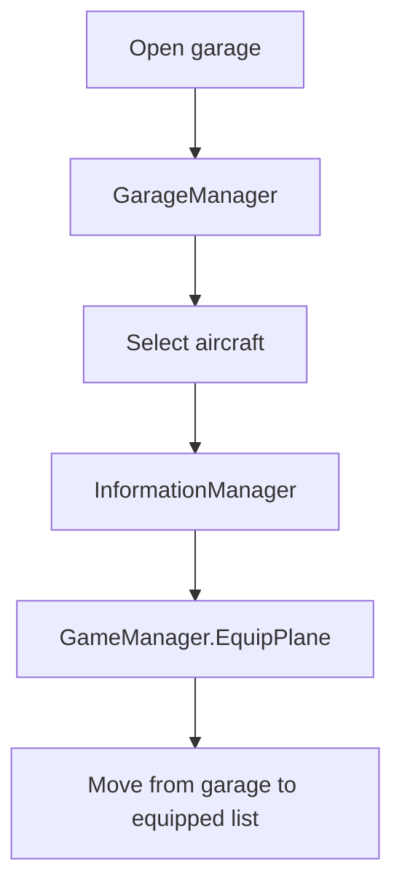

Equipped aircraft are ready to be assigned to routes.

The aircraft moves from:

```text
AirportGarage.planes
```

to:

```text
AirportGarage.EquippedPlanes
```

and is also tracked by `GameManager.EquippedPlanes`.

## 7. Route Creation Flow

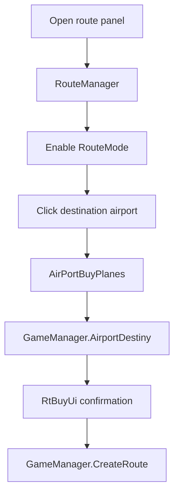

Route creation requires:

- An origin airport
- A destination airport
- Available route slots
- Enough money
- No duplicate route

The route is stored in:

```csharp
Airport.routes
```

and the destination stores the origin in:

```csharp
Airport.inboundRoutes
```

## 8. Aircraft Assignment To Route

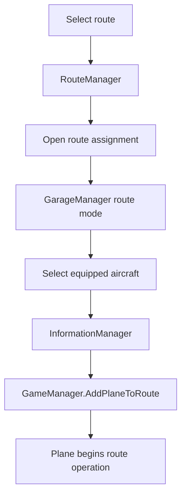

Aircraft assignment validates:

- Selected plane exists
- Current route exists
- Plane is not already on the same route
- Runway capacity is available
- Plane range is acceptable

When assigned, the plane is moved into:

```csharp
GameManager.PlanesInRoute
```

## 9. Autonomous Flight Flow

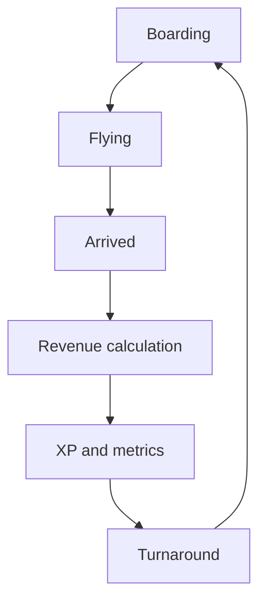

During autonomous operation, `Plane` handles:

- Boarding passengers
- Flying through a Bezier path
- Applying wear
- Calculating revenue
- Updating route stats
- Adding XP
- Turning around for the return trip

## 10. Revenue And Development Flow

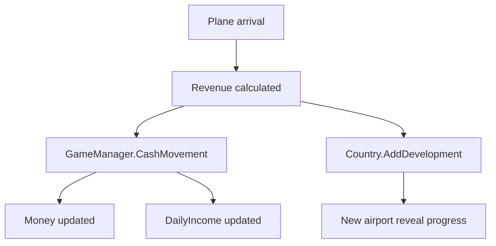

Revenue affects:

- Airline money
- Daily income
- Country development
- Plane XP
- Airport XP
- Route metrics

This is the main growth loop.

## 11. Daily Simulation Flow

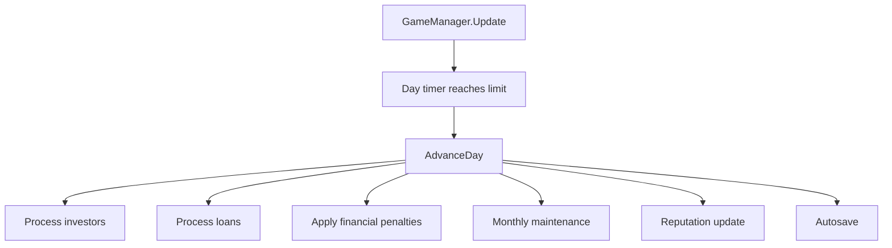

`AdvanceDay()` is responsible for long-term simulation pressure.

It processes:

- Investor payments
- Loan payments
- Unpaid loan penalties
- Maintenance cycles
- Reputation updates
- Autosave
- Date changes

## 12. Maintenance Flow

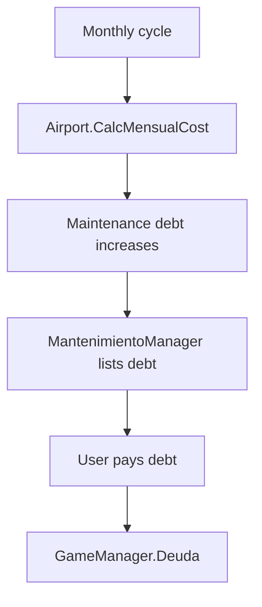

Maintenance creates operational pressure as the network grows.

## 13. Save Flow

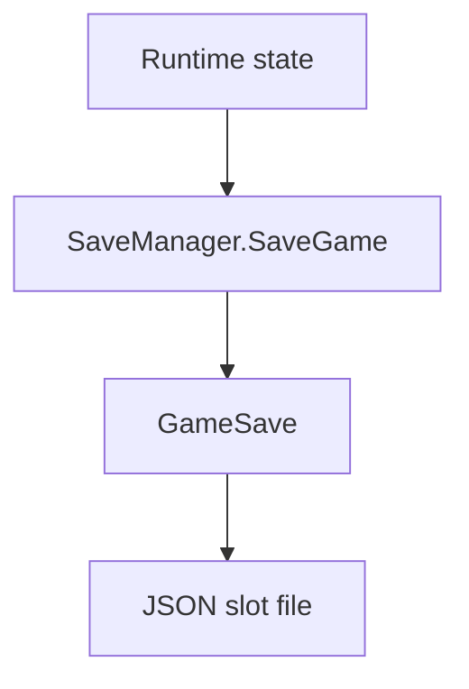

The save flow captures:

- Global state
- Financial state
- Countries
- Airports
- Routes
- Passenger maps
- Aircraft

## 14. Load Flow

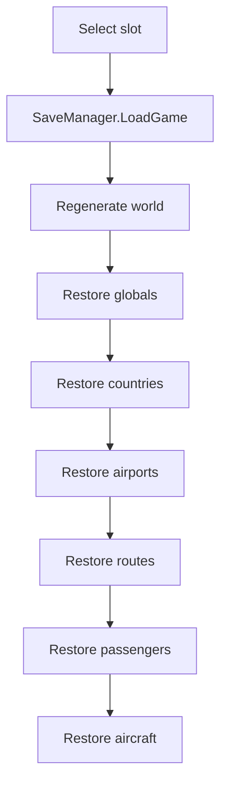

Load is multi-pass because routes and planes depend on airports existing first.

## Summary

The complete system flow can be simplified as:

```text
Data creates world
World creates airports
Airports create demand
Routes connect demand
Aircraft consume demand
Flights create revenue
Revenue creates development
Development reveals expansion
Finance creates constraints
Persistence preserves the graph
```

This end-to-end flow is the core of Transit Empire’s simulation architecture.
