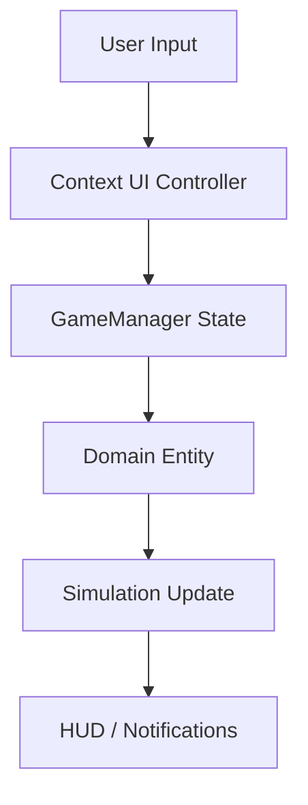

# UI System

Transit Empire uses a contextual UI architecture where each interface controller manages a specific operational area of the simulation.

The UI is not only visual. It acts as the interaction layer between the user and the simulation systems managed by `GameManager`, `Airport`, `Plane`, `Country`, `LoanManager`, and `SaveManager`.

## UI System Overview



## Main UI Controllers

| Component | Responsibility |
|---|---|
| `InformationMain` | Displays global simulation metrics |
| `AirportInformationUiManager` | Displays airport information and routes to airport actions |
| `InformationManager` | Displays aircraft information and executes aircraft actions |
| `CountryUIManager` | Displays country purchase/status information |
| `GarageManager` | Builds contextual aircraft lists |
| `PlaneShopPanel` | Builds aircraft purchase options |
| `RouteManager` | Displays routes and route metrics |
| `RtBuyUi` | Confirms route purchases |
| `LoanManager` | Builds loan, investor, and repayment interfaces |
| `MantenimientoManager` | Builds maintenance debt payment interface |
| `SaveSlots` | Handles save/load slot selection |
| `SettingsMenu` | Handles settings, audio, language, autosave, and notifications |
| `MainMenuCode` | Handles main menu navigation |

## Global HUD

`InformationMain` is the main runtime dashboard.

It displays:

- Current date
- Money
- Global reputation
- Financial penalty value
- Plane count
- Airport count
- Income per minute
- Active route count
- Passenger count
- Company autonomy
- Simulation speed

It also exposes speed controls through plus/minus buttons connected to:

```csharp
GameManager.Instance.PlusSpeed();
GameManager.Instance.MinusSpeed();
```

## Airport Interface

`AirportInformationUiManager` is the main airport operations panel.

It displays:

- Passenger capacity
- Airport name
- Airport reputation
- Infrastructure level data
- Runway usage
- Route slot usage
- Upgrade-related values

It also routes the user toward:

| Button Context | Target |
|---|---|
| Plane shop | `PlaneShopPanel` |
| Garage | `GarageManager` |
| Routes | `RouteManager` |
| Equip mode | `GarageManager` + `InformationManager` |

This controller works as the navigation hub for airport operations.

## Aircraft Information Interface

`InformationManager` is the main aircraft action panel.

It supports multiple modes depending on `GameManager` state flags:

| Mode | Purpose |
|---|---|
| Shop mode | Preview and purchase catalog aircraft |
| Garage mode | Inspect, equip, delete, or upgrade owned aircraft |
| Equipped mode | Unequip aircraft from active status |
| Routing mode | Assign aircraft to a selected route |
| Route fleet mode | Inspect aircraft already assigned to a route |
| Flying mode | Inspect aircraft currently operating on the map |

The panel displays:

- Aircraft stats
- HP
- Wear
- State
- Travel count
- Average revenue
- Route assignment
- XP
- Level
- Stat points

It can execute actions through `GameManager`, including:

- `BuyPlane()`
- `EquipPlane()`
- `DeletePlane()`
- `PlaneJobless()`
- `AddPlaneToRoute()`
- `DeletePlaneRTmode()`

## Garage Interface

`GarageManager` builds aircraft lists depending on the current context.

Supported modes:

| Mode | Aircraft Source |
|---|---|
| Garage | `GameManager.GetGaragePlanes()` |
| Equipped | `GameManager.GetEquippedPlanes()` |
| Route assignment | `GameManager.GetEquippedPlanes()` |
| Route fleet | `GameManager.GetPlanesInRoute()` |

For route assignment, it also applies route-specific visual states:

- Ready
- Out of range
- Current route
- Assigned elsewhere

This makes the garage interface a contextual fleet browser.

## Plane Shop Interface

`PlaneShopPanel` builds aircraft purchase buttons from the current aircraft catalog.

It reads aircraft data from:

```csharp
GameManager.Instance.GetActualPlane()
```

Each generated button:

- Displays aircraft name
- Shows aircraft sprite
- Stores selected aircraft data
- Opens `InformationManager` for purchase confirmation

## Route Interface

`RouteManager` controls the route panel for a selected airport.

It handles:

- Route mode activation
- Route list creation
- Route selection
- Route deletion
- Opening aircraft assignment mode
- Displaying route statistics

Route metrics shown include:

- Route name
- Distance
- Total revenue
- Average revenue
- Total passengers
- Average passengers

## Route Purchase Interface

`RtBuyUi` confirms route creation.

It displays:

- Origin airport
- Destination airport
- Distance
- Price

When the route is confirmed, it marks the route flow as completed and reinitializes `RouteManager`.

## Country Interface

`CountryUIManager` controls country purchase and country status.

It has two major states:

| State | Display |
|---|---|
| Not purchased | Country price, airport count, regional/capital/international airport totals |
| Purchased | Total generated value, owned airports, average reputation, progress bar |

It also uses a separate camera and render texture to show a preview of the selected country.

## Loan Interface

`LoanManager` also contains UI-building responsibilities.

It dynamically creates:

- PerCapita loan offers
- PerAvg loan offers
- Investor offers
- Active loan repayment entries
- Active investor entries

It uses runtime-generated buttons and connects each button to the correct financial action.

## Maintenance Interface

`MantenimientoManager` builds maintenance payment lists.

It groups airports by type:

- Regional
- Capital
- International

Only airports with outstanding maintenance debt are shown.

Clicking a maintenance entry calls:

```csharp
GameManager.Instance.Deuda(ap);
```

## Save Slot Interface

`SaveSlots` manages save/load slot interaction.

It supports:

- Opening slot selection in save mode
- Opening slot selection in load mode
- Previewing slot information
- Saving to selected slot
- Loading from selected slot
- Save and exit
- Exit without save

## Settings Interface

`SettingsMenu` manages:

- Music volume
- SFX volume
- Language toggle
- Autosave toggle
- Notification toggle
- Return to lobby

It updates `Globalsettings` and `AudioManager` directly.

## Menu Interface

`MainMenuCode` manages the main menu.

It handles:

- Start free mode
- Open tutorial
- Open credits
- Open settings
- Exit application
- Localized news and credits text

## UI State Flags

Several UI flows depend on state flags stored in `GameManager`.

Important flags include:

```text
IsGarage
equip
routeequiping
floating
flying
RouteMode
routestate
CanTouchUi
MainUiHidden
Tutorialnow
```

These flags determine which UI mode is active and which actions are valid.

## UI Interaction Pattern

Most UI controllers follow this pattern:

```text
Open panel
→ Read current GameManager state
→ Build contextual buttons
→ User selects object/action
→ Store selected entity in GameManager
→ Execute domain action through GameManager
→ Refresh UI or switch panel
```

## Technical Value

The UI system demonstrates:

- Contextual UI controllers
- Runtime button generation
- Simulation state-driven interfaces
- Multi-mode aircraft inspection
- Route and fleet operation flows
- Save/load slot management
- Settings persistence
- Localization integration
- Mobile-safe UI support
- UI-to-domain orchestration through a central manager

The result is a UI layer that acts as the operational control surface for the simulation.
